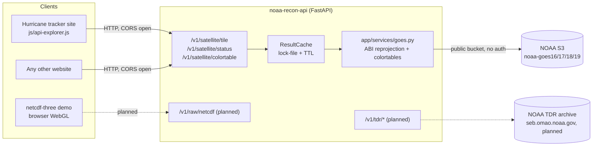
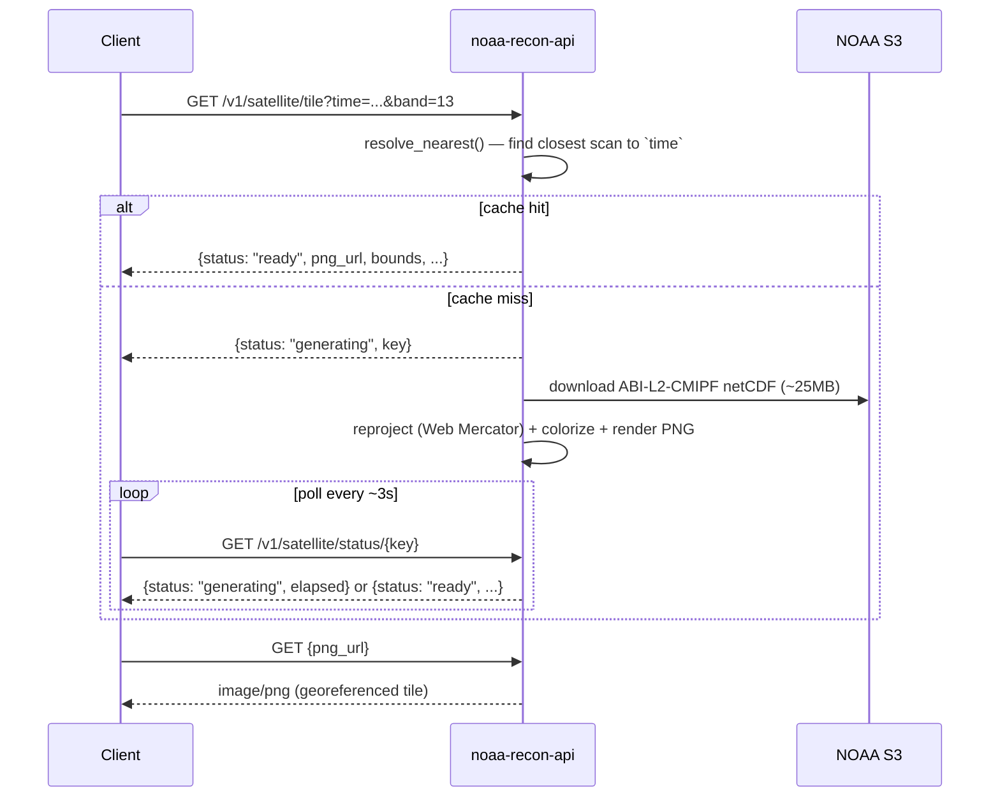

# NOAA Satellite, Recon, and Hurricane API

**Open-source HTTP API for archival GOES satellite imagery, NOAA Tail
Doppler Radar data, storm tracks, and aircraft reconaissance data.**

[](LICENSE)
[](https://joshmurdock.net/api/docs)

**[API.md](API.md)** — full endpoint reference

**[llms.txt](llms.txt)** — terse agent-discovery summary, also served
live at `{base}/llms.txt`


Output from `GET /v1/satellite/tile` — GOES-19, Band 13 (Clean
Longwave IR), the `abi13` standard enhancement, a 1000 nautical-mile box
centered on the storm (17.55°N, 78.14°W, 2025-10-28 12:00 UTC):


Hurricane Melissa (2025)

```bash
curl "https://joshmurdock.net/api/v1/satellite/tile?time=2025-10-28T12:00:00Z&band=13&center=17.55,-78.14&dims=1000&unit=nm"
```

## What this API does

- **Archival GOES satellite tiles on demand.** Give it any UTC timestamp
  (not just hourly buckets) and it finds the nearest real ABI scan
  (~10-minute cadence), downloads it from NOAA's public S3 archive,
  reprojects it, and returns a georeferenced PNG ready to drop onto a
  Leaflet map.
- **Both GOES-East and GOES-West**, auto-resolved to the correct satellite
  (GOES-16/19 East, GOES-17/18 West) for the requested date — covers the
  full ABI era (~2017-2018 onward). Pre-ABI storms (e.g. Katrina, 2005)
  aren't reachable this way; see "Satellite coverage" in API.md for why.
- **The correct color table for the band you asked for.** `cmap=default`
  resolves to the right per-band standard enhancement — `abi13` (Clean
  IR), `abi9` (water vapor), `abi7` (shortwave IR / "fire temperature"),
  `abi5` (near-IR reflectance), `abi3` (Veggie/vegetation reflectance), or
  `abi2` (red/visible reflectance) — built from exact temperature→color
  stops (or a reflectance ramp for bands 2/3/5), not a generic
  approximation. See ["How the imagery is
  processed"](#how-the-imagery-is-processed) below for exactly how each
  one is computed, and [the live color legend tool](#color-legend) for
  rendering one client-side.
- **Composite products**: `product=sandwich` (Band 13 IR modulated by
  Band 2 visible texture) and `product=geocolor` (a documented
  approximation of NOAA's day/night true-color+IR composite — see
  ["How the imagery is processed"](#how-the-imagery-is-processed) below
  for the exact blend formulas, or `GET /v1/satellite/products` for a
  machine-readable summary). Both support `center`/`dims` bbox cropping
  the same as a single-band tile.
- **`GET /v1/satellite/products`** — discovery endpoint listing every band/
  product this API can render and the exact UTC date range each satellite
  covers, so a client can build a picker without hardcoding any of that.
- **Fast, high-detail regional crops.** Pass `center` + `dims` (km or
  nautical miles) instead of rendering the slow, coarse full disk —
  ~11x faster, ~130x smaller files, at the sensor's native ~2km/pixel
  resolution by default.
- **Correctly georeferenced for web maps.** Output rows are spaced in Web
  Mercator, matching how Leaflet/Google Maps/every standard web map
  actually projects the earth — see "Real bugs found and fixed" below.
- **A raw-netCDF path for client-side rendering** (in progress) feeding a
  Three.js/WebGL volumetric viewer, for users who want the data itself
  rather than a pre-rendered image.
- **Historical storm tracks, named storms only.** Feed a year, storm
  name, and any UTC datetime and get back the closest actual best-track
  fix — lat/lon, Saffir-Simpson category, wind, and pressure. Backed by
  NHC's HURDAT2 archive (Atlantic + East/Central Pacific since 1950) for
  the reconciled historical record, plus NHC's operational ATCF b-decks to
  bridge the gap up through the storm happening right now — kept current
  by a nightly systemd timer. Plus discovery endpoints for what
  years/storms are on record. See `GET /v1/storms/*` in API.md and "Storm
  archive updates" below.
- **Recon MET archive — every hurricane hunter flight since 2011.**
  Look up archived flight-level observation data (position, wind,
  SFMR surface wind, altitude) by year and storm name, then fetch one
  mission by `mission_id` — decimated data inline for quick plotting, or
  `GET /v1/recon/mission/{id}/download` to stream NOAA's original
  full-resolution NetCDF file (600+ variables — attitude, airspeed, every
  raw sensor channel, not just the ~7 fields this project decimates).
  Same year/storm discovery shape as the storm-track archive, so the two
  can be cross-referenced from one API. Kept current by its own nightly
  systemd timer. See `GET /v1/recon/*` in API.md and "Recon MET archive" below.

---

# Installation

**Linux**

Utilize the following install script to automatically install the API on your hardware. The installer works on Fedora/RHEL/Rocky/CentOS (`dnf`), Debian/Ubuntu (`apt`), and NixOS (`nix`) distributions, and other distributions sharing one of these package managers.
This install script creates a fully-configured, self-updating instance, including dependencies, systemd service, nginx/Apache + SSL support for self-hosted domains, and the storm/recon archives.

```bash
bash -c "$(curl -fsSL https://raw.githubusercontent.com/jjmurdock19/noaa-recon-api/main/install.sh)"
```
See **[INSTALL.md](INSTALL.md)** for a plain-language walkthrough of each prompt from the install wizard, or the
["Manual setup"](#manual-setup) section below to do each step by hand.

**Windows**

The API can be deployed on Windows for local testing.

```powershell
irm https://raw.githubusercontent.com/jjmurdock19/noaa-recon-api/main/install.ps1 | iex
```

The API runs as a plain background process started/stopped by the user (`noaa-recon-api start`/`stop`). This is not a Windows
Service or login-autostart. See **[INSTALL.md](INSTALL.md#windows-local-testing)**.

### Requirements

**Linux** — Fedora/RHEL/Rocky/CentOS, Debian/Ubuntu, or a distribution with the Nix
package manager (anything with `dnf`, `apt`, or `nix` on `PATH`), plus `sudo`
access so the installer can install packages and write system files (it does
not need to be run as `root`). Everything else — git, Python 3.9+, a C
compiler (needed to build `netCDF4`'s C extensions), and optionally nginx/
Apache + certbot for HTTPS — is detected and installed automatically if
missing; you don't need to pre-install any of it.

**Windows** — git and Python 3.9+ (installed via `winget` if missing and you
approve it; PowerShell is built in). Local-testing scope only — no reverse
proxy, domain, or HTTPS, see above.

**Python dependencies** (installed into an isolated virtualenv the installer
creates — never your system Python): FastAPI, Uvicorn, netCDF4, NumPy,
Pillow, httpx, itsdangerous, pypdf. Exact pinned versions are in
[`pyproject.toml`](pyproject.toml).

### What the installer does

`install.sh` is a single self-contained Bash script — no external installer
framework or package to fetch beyond the script itself:

1. Detects your package manager (`dnf`/`apt`/`nix`) and installs git, Python
   3, and a C compiler if any are missing.
2. Clones this repo to an install directory of your choice
   (`/opt/noaa-recon-api` by default).
3. Creates a Python virtualenv inside that directory and installs the API's
   dependencies into it — isolated from system Python.
4. Writes and enables a **systemd service** so the API starts on boot and
   restarts itself if it crashes.
5. Optionally installs/configures **nginx or Apache** as a reverse proxy for
   a domain deployment, and can request a free **Let's Encrypt** HTTPS
   certificate via `certbot`.
6. Builds the storm-track and recon MET archives (SQLite databases under
   `data/`) and installs three nightly **systemd timers**: two to keep them
   current going forward, plus one to clear out stale cached netCDF files.
7. Installs a `noaa-recon-api` CLI command (`start`/`stop`/`status`/`logs`/
   `update`/`uninstall`) for living with the install afterward.

Re-running the same one-liner on a machine that already has it installed
offers **Update** (pull latest `main`, restart) or **Reconfigure** (re-run
the wizard with your previous answers pre-filled as defaults) instead of
installing a second copy. See [INSTALL.md](INSTALL.md) for a plain-language
walkthrough of every prompt the wizard asks.

---

# Data Information


**Status:** Undergoing active development. Satellite tiles, storm tracks, and the recon archive
are fully implemented and verified against live NOAA data. TDR data is still in the works (`501 Not
Implemented`) — see "Roadmap" below.

## Sources

All data served by this API is fetched and cached from publicly-accessible NOAA data sources. Exact
endpoints, for reproducibility and citation:

**GOES satellite imagery** — [NOAA GOES-R Series on AWS Open Data](https://registry.opendata.aws/noaa-goes/),
unauthenticated public S3 buckets. This API reads the `ABI-L2-CMIPF`
(Cloud and Moisture Imagery, Full Disk) product directly:
- East: [`noaa-goes16`](https://noaa-goes16.s3.amazonaws.com/) (2017-12-18 – 2025-01-14), [`noaa-goes19`](https://noaa-goes19.s3.amazonaws.com/) (2025-01-14 – present)
- West: [`noaa-goes17`](https://noaa-goes17.s3.amazonaws.com/) (2019-02-12 – 2023-01-10), [`noaa-goes18`](https://noaa-goes18.s3.amazonaws.com/) (2023-01-10 – present)
- Object path: `ABI-L2-CMIPF/{year}/{day-of-year}/{hour}/` within each bucket
  (see `_get_satellite_bucket()` in `app/services/goes.py` for the exact
  cutover-date logic, and "Satellite coverage" in API.md for what's out of
  reach — pre-ABI storms like Katrina 2005 aren't in these buckets at all).

**Storm tracks** — [NHC (National Hurricane Center)](https://www.nhc.noaa.gov/):
- [HURDAT2](https://www.nhc.noaa.gov/data/#hurdat), the reconciled historical best-track database:
  [Atlantic, 1851–2024](https://www.nhc.noaa.gov/data/hurdat/hurdat2-1851-2024-040425.txt) and
  [East/Central Pacific, 1949–2023](https://www.nhc.noaa.gov/data/hurdat/hurdat2-nepac-1949-2023-042624.txt)
- [ATCF](https://ftp.nhc.noaa.gov/atcf/) (Automated Tropical Cyclone Forecasting) b-decks, which bridge the
  gap from HURDAT2's cutoff up through whatever's happening right now:
  [current season](https://ftp.nhc.noaa.gov/atcf/btk/) and
  [closed-season archive](https://ftp.nhc.noaa.gov/atcf/archive/) (per-year subdirectories)

**Recon MET archive** — [NOAA OMAO](https://www.omao.noaa.gov/)'s (Office of Marine and Aviation
Operations) Aircraft Operations Center raw data archive at
[`seb.omao.noaa.gov/pub/acdata`](https://seb.omao.noaa.gov/pub/acdata/), organized
`{year}/MET/{mission_id}/`. Every hurricane hunter flight since 2011: this
API decimates the QC'd 1-second flight-level NetCDF file (position, wind,
SFMR surface wind, altitude) to ~7 fields for quick plotting, and
`GET /v1/recon/mission/{id}/download` streams NOAA's original
full-resolution file (600+ variables) unmodified, straight from that same
archive.

**TDR (planned, not yet implemented)** — same host as the recon archive,
[`seb.omao.noaa.gov/pub/acdata`](https://seb.omao.noaa.gov/pub/acdata/), but
targeting the per-instrument Tail Doppler Radar `.tar.gz` bundles in each
mission directory rather than the MET NetCDF file. See `app/routers/tdr.py`'s
docstring for exactly what's missing (there's no manifest, so it needs a
crawler over the mission-directory listing).

## Imagery Processing

Every tile goes through the same four stages — `app/services/goes.py` is
the whole pipeline, no external image-processing service involved:

1. **Fetch.** `resolve_nearest()` picks the closest actual ABI scan to the
   requested `time` (~10-minute cadence), then `ensure_downloaded()` pulls
   that scan's raw `ABI-L2-CMIPF` netCDF (~25MB per band) straight from
   NOAA's public S3 bucket — see "Data sources" above. Composites
   (`sandwich`, `geocolor`) fetch every companion band from that *same*
   scan cycle, since ABI captures all bands simultaneously and there's no
   time-misalignment to correct for.
2. **Reproject.** Raw ABI data is on a satellite-fixed scan grid (radians
   from the sub-satellite point), not lat/lon. `abi_to_latlon()` converts
   it per the GOES-R Product User Guide's Volume 5 Section 4.2 formula,
   then each output row is spaced linearly in **Web Mercator Y**
   (`_mercator_y()`), not linearly by latitude — because that's what
   `L.imageOverlay` and every standard web map actually assume when they
   stretch an image between two corner coordinates. Getting this wrong
   visibly mispositions the image (see bug #4 below); it's easy to get
   wrong because a plain equirectangular projection *looks* almost right
   at low latitudes and only clearly breaks near the poles or on a large
   box. Where multiple source pixels land on the same output cell (common
   — several hundred collisions on a typical crop), `_paint_coldest()`
   deterministically keeps the coldest value, since that's the
   meteorologically significant one for cloud-top imagery, not whichever
   pixel numpy happened to process last.
3. **Colorize** — see the next section for exactly how each band/cmap gets
   its color.
4. **Encode.** The colorized array becomes an RGBA PNG: pixels with actual
   scan data get `alpha=220` (~86% opaque, so the base map still shows
   faintly through the overlay); off-disk or no-data pixels get
   `alpha=0` (fully transparent, so Leaflet never paints a hard edge
   where the satellite's view ends). Saved straight to the on-disk cache
   (`ResultCache`) that `/v1/satellite/status` and `png_url` read from.

### Color grading

`_colorize()` picks one of three strategies depending on the band/cmap,
and which one matters for accuracy:

- **Reflectance bands (3, 5)** have no "temperature" — `_reflectance_gray()`
  gamma-stretches the 0–1 reflectance factor (`refl ** (1/1.5) * 255`)
  to a 0–100% grayscale ramp. Linear reflectance reads unnaturally
  dark/flat to the eye, so VIS/near-IR imagery is conventionally displayed
  gamma-stretched — the same idea (not a tuned match) as satpy's default
  reflectance enhancement.
- **`abi13`/`abi9`/`abi7`** (the recommended per-band default enhancements)
  are evaluated **exactly**, per-pixel, via `_apply_stops_exact()`
  (vectorized `np.interp` over the literal temperature→color stops in
  `_ABI13_STOPS`/`_ABI9_STOPS`/`_ABI7_STOPS`) rather than through a
  quantized lookup table. This is deliberate, not an optimization detail:
  `abi13`'s source palette has a genuinely sharp 1°C-wide cut (cyan@-32°C
  → light grey@-31°C, marking the severe-convection threshold), and
  quantizing that into ~0.6°C buckets smears it into a muddy blended color
  that isn't in the source palette at all — see bug #2 below for the
  before/after. **If you add a colortable with a similarly sharp
  transition or a range outside ~-113..+42°C, add it to `STOPS_BY_CMAP`,
  not `LUTS`.**
- **Everything else** (`bd`, `enhanced`, `nrl`, `grayscale`, `ir4`) goes
  through a shared 256-entry LUT (`_build_lut()`), built once at import
  time by sampling each palette function every ~0.6°C across a fixed
  -113..+42°C window. Fine for palettes without a hard cut, cheaper than
  exact evaluation, but the fixed window means these clip anything warmer
  than +42°C to the same color — irrelevant for 9/13, but it silently
  loses Band 7's fire-highlighting range above that, which is exactly why
  `abi7` (not one of these) is Band 7's default.

`GET /v1/satellite/colortable` (below) reads these same structures
(`STOPS_BY_CMAP`/`LUTS`) at request time, so a legend built from it is
guaranteed to match what a render actually produced — not a hand-copied
approximation that can drift out of sync.

**`product=sandwich`** 
`render_sandwich_to_png()` colorizes Band 13 with the exact `abi13`
enhancement, then **multiplies** every pixel's RGB by a brightness factor
derived from Band 2 (visible) reflectance: `brightness = 0.35 + 0.65 *
clip(vis_reflectance, 0, 1)`. Fully sunlit, high-reflectance cloud tops
(fresh overshooting tops, gravity waves) stay near full IR color;
low-reflectance areas darken toward 35% — enough to reveal visible-light
texture the IR channel alone smooths over, without ever fully hiding the
underlying IR colorization. At night (or wherever Band 2 has no data for
the requested crop, e.g. right at the scan's limb), there's no visible
signal to modulate with, so it falls back to a flat 0.35 brightness — a
uniformly darkened plain-IR look, matching how real sandwich products
behave outside daylight rather than hiding the night side entirely.

**`product=geocolor`** 

`render_geocolor_to_png()` is an explicitly-labeled **approximation**,
not NOAA/CIRA's proprietary GeoColor algorithm (that includes full
atmospheric/Rayleigh correction and a static city-lights layer this
project has no access to). What it does instead:

- **Day:** synthetic true color from Bands 1 (blue) / 2 (red) / 3
  (veggie/NIR) reflectance. ABI has no native green channel, so green is
  synthesized with CIRA's published recipe
  `green = 0.45*red + 0.10*NIR + 0.45*blue`, the same formula behind most
  open-source ABI "true color" composites (e.g. satpy's).
- **Night:** the standard `abi13` colorized IR, identical to the
  standalone Band 13 product.
- **Terminator blend:** `_solar_zenith_deg()` computes a low-precision
  per-pixel solar zenith angle (NOAA/Spencer Fourier-series approximation
  — public-domain, the same formula behind NOAA's online solar
  calculator; accurate to a fraction of a degree, plenty for a
  several-degree-wide blend, not ephemeris-grade). Full day color inside
  ~85° zenith, full night IR beyond ~95°, linearly blended across that
  ~10° terminator band in between.
- **Missing versus true Geocolor:** no city-lights, no
  aerosol/Rayleigh atmospheric correction.

Both composites crop and read each companion band directly from its
source file at a stride for a bbox request (`_read_source_cropped()`)
rather than materializing the full disk first — see bug #7 below for why
that matters (Band 2 at native 0.5km resolution is large enough to OOM a
small deployment host if read whole).

## Colortables

`GET /v1/satellite/colortable` returns the exact colortable used to render a product, giving the end user the power to create an exact-copy legend. Default colortables are sources from the ABI colortables.

```bash
curl "https://joshmurdock.net/api/v1/satellite/colortable?cmap=default&band=13"
```

`GET /v1/satellite/colortables?band=13` (plural) lists every color table
usable with a given band — names, descriptions, and which one's the
default — for building a picker UI without hardcoding the cmap catalog
client-side; `?product=sandwich`/`geocolor` returns the single fixed
enhancement a composite uses instead, since composites don't take a
`cmap` choice. See API.md for both.

---

# Architecture



## Request flow (satellite tile)



---

## Manual setup

*Deploying to a server and want the systemd service, nginx/HTTPS, and
archives set up for you instead? Use `./install.sh` — see
[INSTALL.md](INSTALL.md) or "Deploy your own copy" above. What follows
is the same thing done by hand, step by step, for local dev or anyone
who wants full manual control.*

```bash
git clone --recurse-submodules <this-repo-url>
cd noaa-recon-api
python3 -m venv .venv
source .venv/bin/activate
pip install -e ".[dev]"

uvicorn app.main:app --reload
# -> http://127.0.0.1:8000/docs   (Swagger UI, full endpoint surface)
# -> http://127.0.0.1:8000/       (admin console — see below)
```

Already cloned without `--recurse-submodules`? Run `git submodule update --init`.

Try it:

```bash
curl "http://127.0.0.1:8000/v1/satellite/tile?time=2024-09-28T12:00:00Z&band=13"
# -> {"status": "generating", "key": "goes_13_abi13_..."}
curl "http://127.0.0.1:8000/v1/satellite/status/<key>"
# -> poll until {"status": "ready", "png_url": "/cache/satellite/<key>.png", "bounds": [[lat,lon],[lat,lon]], ...}
```

### Tests

```bash
pytest                                          # offline unit tests (math, LUTs, parsing)
NOAA_RECON_API_NETWORK_TESTS=1 pytest           # + a live end-to-end render against NOAA S3
```

### Docker

```bash
docker compose up --build
```

### Deploying on this host (joshmurdock.net)

*Already done — this is documented for reference / redeploying after a host
rebuild. The live API is at `https://joshmurdock.net/api`.*

1. `python3 -m venv .venv && pip install -e .` as above.
2. Copy `deploy/noaa-recon-api.service` to `/etc/systemd/system/`, then
   `systemctl daemon-reload && systemctl enable --now noaa-recon-api.service`.
3. Paste the block from `deploy/nginx-snippet.conf` into the `joshmurdock.net`
   `server {}` block in `/etc/nginx/nginx.conf`, then `nginx -t && systemctl
   reload nginx`. This makes the API reachable at `/api/...` on the
   hurricanes site, same-origin (no CORS needed for that consumer; CORS is
   still open for other sites hitting the API directly).

### Deploying elsewhere (fresh host, building both archives from scratch)

*`./install.sh` does everything below automatically, including asking
whether to build the full recon archive or the fast current-season-only
version. This section is the manual equivalent, for anyone not using it.*

Both `GET /v1/storms/*` and `GET /v1/recon/*` are backed by local SQLite
databases under `data/` (gitignored — not part of the repo, built by the
ingestion scripts below). A brand-new deployment has neither database yet;
build both once, then install the nightly timers so they stay current
without further attention:

```bash
# Storms: always does a full HURDAT2 + ATCF backfill automatically (fast, ~10s)
.venv/bin/python3 scripts/ingest_storms.py

# Recon MET: --full crawls every year since 2011 from scratch — this is
# thousands of small requests plus large NetCDF downloads and PDF parses,
# expect this to take HOURS on a fresh deployment (the nightly default,
# current + previous year only, is what runs afterward and is quick)
.venv/bin/python3 scripts/ingest_recon_met.py --full
```

Then install both nightly timers (details in the two sections below) so
each archive keeps itself current going forward without manual re-runs.
The admin console's "Databases" panel also has a **Force update** button
per archive if you ever want to trigger an update immediately instead of
waiting for the timer (e.g. right after a storm you care about was flown).

### Storm archive updates

`data/storms.sqlite` (the `GET /v1/storms/*` backing store) is populated
by `scripts/ingest_storms.py` — see app/services/storms.py's module
docstring for the HURDAT2 + ATCF b-deck pipeline. Run it manually any time:

```bash
.venv/bin/python3 scripts/ingest_storms.py
```

To keep it current automatically (picks up the latest advisory for any
storm active right now), install the nightly timer:

```bash
sudo cp deploy/storm-archive-update.service deploy/storm-archive-update.timer /etc/systemd/system/
sudo systemctl daemon-reload
sudo systemctl enable --now storm-archive-update.timer
```

Fires nightly at 03:15 (server local time); `Persistent=true` means a
missed run (host was down) fires on next boot instead of waiting a full
day. Both units show up in Cockpit's Services page like any other systemd
unit — search "storm-archive-update" to check last-run status or trigger
a manual run from there instead of the command line.

### Recon MET archive

`data/recon_met.sqlite` (the `GET /v1/recon/*` backing store) is populated
by `scripts/ingest_recon_met.py` — see app/services/recon_met.py's module
docstring for the crawl/decimation pipeline (NOAA's raw 1-second
flight-level data at `seb.omao.noaa.gov`, stored at 0.2 Hz). Run it
manually any time:

```bash
.venv/bin/python3 scripts/ingest_recon_met.py               # current + previous year (nightly default)
.venv/bin/python3 scripts/ingest_recon_met.py --full         # every year since 2011 — see the warning above
.venv/bin/python3 scripts/ingest_recon_met.py --year 2024    # one year only
```

Idempotent: each mission is skipped unless its QC version on the server
changed, so a nightly re-run only does real work for new/upgraded
missions. Install the nightly timer the same way:

```bash
sudo cp deploy/recon-met-update.service deploy/recon-met-update.timer /etc/systemd/system/
sudo systemctl daemon-reload
sudo systemctl enable --now recon-met-update.timer
```

Fires nightly at 03:45 (30 minutes after the storm archive timer, so the
two crawls don't compete for network/CPU at the same instant);
`Persistent=true` for the same missed-run-catches-up-on-boot behavior.
Also visible in Cockpit's Services page (search "recon-met-update").

This deployment's `data/recon_met.sqlite` was seeded via
`scripts/import_existing_met_archive.py`, a one-time local copy from the
hurricanes site's already-harvested `met_archive.sqlite` (same underlying
data, this project just now owns the feature) rather than re-crawling
years of identical data over the network — not needed on a fresh
deployment with no pre-existing archive, hence `--full` above instead.

### GOES netCDF cache cleanup

`cache/goes_nc/` holds the raw netCDF scans downloaded from S3 before
rendering (see `ensure_downloaded()` in `app/services/goes.py`) — they're
re-fetched on demand, so nothing is lost by deleting old ones. Run the
cleanup manually any time:

```bash
.venv/bin/python3 scripts/clear_nc_cache.py                    # delete files older than 24h
.venv/bin/python3 scripts/clear_nc_cache.py --max-age-hours 48 # different cutoff
.venv/bin/python3 scripts/clear_nc_cache.py --dry-run          # preview only, deletes nothing
```

Install the nightly timer to keep the cache trimmed automatically:

```bash
sudo cp deploy/goes-nc-cache-cleanup.service deploy/goes-nc-cache-cleanup.timer /etc/systemd/system/
sudo systemctl daemon-reload
sudo systemctl enable --now goes-nc-cache-cleanup.timer
```

Fires nightly at 04:15 (after both archive-update timers), deleting any
cached netCDF file older than 1 day. `Persistent=true` for the same
missed-run-catches-up-on-boot behavior as the other timers. Also visible
in Cockpit's Services page (search "goes-nc-cache-cleanup").

### Admin console

Visiting the API's root (`/` locally, `https://joshmurdock.net/api` in
production) serves a login-gated admin console — status/cache stats,
browsing and deleting cached rendered tiles and raw netCDF downloads,
submitting a one-off query, and bulk-loading a timeframe into the cache
(e.g. pre-warm an entire storm's lifecycle in one request instead of
loading frame-by-frame later). A "Databases" panel covers the storm-track
and recon MET archives: size/record-count cards folded into the same
overall totals, a browsable viewer (pick a database, year, and storm to
see its track points or missions), and a **force update** button per
archive to run that archive's nightly ingest immediately instead of
waiting for the timer.

Every console user has their own account with one of two roles (see
"API tokens & accounts" below for how they're created):

- **superuser** — everything, including account/token management and
  triggering self-update.
- **moderator** — everything except account/token management and
  self-update — cache, logs, databases, archive-rebuild triggers, and the
  usage log.

The very first account is bootstrapped automatically the first time the
app starts: **`admin_credentials.json`** at the repo root (gitignored,
created with `admin`/`password` defaults on first run if missing — the
installer always generates a real password instead, see INSTALL.md)
becomes the first superuser, with its plaintext password re-hashed into
the new PBKDF2 scheme (`app/services/tokens.py`'s
`migrate_legacy_admin_credentials()` — a one-time-idempotent fixup, same
pattern as `recon_met.py`'s `migrate_*`/`reconcile_*` functions). That
file's `secret_key` is still what signs the session cookie
(Starlette's `SessionMiddleware` + `itsdangerous`) — it's no longer the
active credential store once at least one account exists, so editing the
username/password in it after that point has no effect; manage accounts
from the console's API management pane (or directly against
`data/auth.sqlite`) instead.

The console itself is a static page (`app/console/index.html`, no build
step, matching the rest of this project) that calls the JSON endpoints
under `/v1/admin/*` (see API.md).

### API tokens & accounts

Off by default. A deployer can require an `Authorization: Bearer <token>`
header on every public `/v1/*` data call (satellite/storms/recon/tdr/raw —
`/v1/health` and the admin console always stay open) — useful for tracking
or restricting who's calling your instance. Toggle it at install time (the
installer asks) or later from the console's API management pane
(superuser only) — takes effect immediately, no restart.

Three roles, one `tokens` table (`data/auth.sqlite`, same schema-in-code-
string/`get_connection()` pattern as `storms.sqlite`/`recon_met.sqlite` —
see `app/services/tokens.py`):

- **regular** — a plain API key. No console login, tracked in the usage
  log by owner name.
- **moderator** / **superuser** — a console username+password *and* an API
  key (the same token doubles as both — a superuser calling the public API
  programmatically uses their own token same as anyone else).

Token secrets are high-entropy (`secrets.token_urlsafe(32)`) and stored as
a fast hash (`sha256`) — safe to look up on every request without a slow
KDF, since brute-forcing a 32-byte random value is infeasible regardless
of hash speed. Passwords are human-chosen and lower-entropy, so those get
a proper slow KDF (`hashlib.pbkdf2_hmac`, 310k iterations, OWASP's current
baseline) — no new dependency, both are stdlib `hashlib`/`secrets`/`hmac`.
A raw token/password is only ever shown once, at creation or regeneration
time, exactly like a GitHub PAT.

Every console login attempt (success or failure) lands in the login log;
every authenticated public-API call lands in the usage log — both
denormalize the owner name/role/username onto each row rather than only
storing a foreign key, so history stays meaningful even after a token is
deleted.

### netcdf-three demo client

`clients/netcdf-three-demo/index.html` is a static page (no build step) that
proves the raw-netCDF → browser-rendering path end-to-end using the
[netcdf-three](https://github.com/umrlastig/netcdf-three) library, vendored
as a git submodule at `clients/netcdf-three-demo/vendor/netcdf-three`.

```bash
cd clients/netcdf-three-demo
python3 -m http.server 8765
# -> open http://127.0.0.1:8765/ in a browser
```

It defaults to the sample dataset bundled with the netcdf-three submodule.
**This has been verified to serve correctly (all assets return 200, the
sample file parses and contains real 3D variables) but has not been visually
verified in an actual browser** — there's no display/headless-browser
available in the environment this was built in. Open it in a real browser
and confirm the volume actually renders before relying on it.

---

## Agentic instructions

This section is for an AI agent picking up one of the roadmap items below
without re-deriving the architecture.

### Repo shape

```
app/
  main.py            FastAPI app, CORS (open — this API is meant for other sites too), configure_logging()
                      (called at import time, before anything else logs), the log_requests middleware
                      (one line per request to logs/app.log, plus per-token usage-log recording — see
                      _record_token_usage), SessionMiddleware (admin console auth), a startup event that
                      runs tokens.migrate_legacy_admin_credentials() once, router includes (satellite/tdr/
                      raw/storms/recon get require_api_token as a router-level dependency; health and admin
                      don't), /cache + /demo/netcdf-three static mounts, GET /llms.txt, and the console
                      static mount at "/" (registered LAST so it doesn't shadow the more specific routes
                      above it).
  auth.py            Two mechanisms: console session (require_login, require_superuser — reads
                      request.session, set by admin.py's /login against app/services/tokens.py) and the
                      public-API token gate (require_api_token, a no-op unless auth_config.json's
                      "enabled" is true — see is_auth_enabled()/set_auth_enabled()). Still owns
                      admin_credentials.json (gitignored, repo root) purely as the session cookie's
                      secret_key source and the one-time legacy-migration input — it's no longer the
                      active credential store once any token exists.
  logging_config.py    configure_logging(): rotating file handler (10MB x5) attached to the ROOT logger
                        ONLY — attaching to "uvicorn.error"/"uvicorn.access" too caused every line to be
                        logged twice (they propagate to root by default; found and fixed empirically, see
                        the module docstring). app.* loggers (e.g. goes.py's `log`) need no extra setup.
  paths.py            CACHE_ROOT = <repo>/cache, REPO_ROOT
  models.py            Pydantic response schemas
  console/index.html   Static admin console UI (no build step) — login form + dashboard + cache preview
                        pane (tile images w/ full metadata, netCDF dimension/variable/attribute inspection),
                        calls /v1/admin/*. All requests are prefixed with a runtime-computed API_BASE (see
                        "Real bugs" below) — never hardcode a path starting with "/" in this file.
  routers/
    satellite.py       GET /v1/satellite/tile, /status/{key}, /colortable  — IMPLEMENTED
    admin.py            GET/POST /v1/admin/* — login/logout/whoami, status, cache list/delete (satellite
                         + goes_nc separately, goes_nc also has a GET .../info for netCDF structural
                         metadata), bulk prefetch (POST /prefetch, GET /prefetch/{job_id}), self-update
                         (check/apply require_superuser; status polling stays require_login). Prefetch
                         jobs are tracked in an in-memory dict (fine for this scope — lost on restart,
                         not persisted).
    admin_tokens.py      GET/POST/PATCH/DELETE /v1/admin/tokens*, GET /v1/admin/login-log,
                         GET /v1/admin/usage-log, GET/POST /v1/admin/auth-config. Split out from admin.py
                         so all the RBAC-sensitive (mostly require_superuser) surface lives in one file —
                         usage-log is the one route here a moderator can also hit.
    tdr.py              GET /v1/tdr/missions, GET /v1/tdr/sweep                — STUB (501)
    raw.py              GET /v1/raw/netcdf                                     — STUB (501)
    health.py           GET /v1/health
  services/
    tokens.py            Token/account store backing both auth mechanisms above — data/auth.sqlite, same
                         schema-in-code-string/get_connection() pattern as storms.py/recon_met.py. sha256
                         for token secrets (high-entropy, fast lookup is fine), PBKDF2-HMAC-SHA256 (310k
                         iterations) for passwords. migrate_legacy_admin_credentials() is the one-time-
                         idempotent fixup that bootstraps the first superuser from admin_credentials.json.
    goes.py             Ported from the hurricanes site's goes_tile.py: ABI Fixed Grid reprojection
                         (PUG Vol 5 Sec 4.2), Web Mercator row spacing (_mercator_y — see "Real bugs"
                         below), collision-safe forward-paint (_paint_coldest), per-band "default ABI"
                         colortables (abi13, abi9 — exact stops, evaluated without LUT quantization via
                         _apply_stops_exact/STOPS_BY_CMAP) plus 5 LUT-based approximate tables in LUTS.
                         resolve_nearest() picks the closest scan to an arbitrary timestamp for true
                         ~10-min resolution. render_bbox_to_png() is a two-pass sparse-locate +
                         native-resolution-crop renderer for center+dims requests (render_to_png() is
                         the full-disk path).
    cache.py            ResultCache: lock-file + TTL pattern (mirrors proxy.php's approach),
                         driven by FastAPI BackgroundTasks instead of subprocess/nohup. Also has
                         list_keys()/delete()/stats() for the admin console's cache browser.
    tdr.py              Empty stub — see its docstring for the planned crawler/parse/render shape.
admin_credentials.json        Gitignored, auto-created on first run — session secret + legacy-migration
                               input only, not the active credential store (see README "Admin console").
auth_config.json               Gitignored — {"enabled": bool}, whether the public API requires a token.
                               Absent = disabled (today's open-by-default behavior). See README "API
                               tokens & accounts".
logs/app.log                  Gitignored, auto-created on first run — rotating request/error log (see API.md "Logging").
clients/netcdf-three-demo/   Static demo client (see "netcdf-three demo client" above)
deploy/                       nginx snippet + systemd unit for this specific host (joshmurdock.net) —
                               install.sh generates its own versions of these for other machines
install.sh                    Interactive installer/updater/uninstaller (dnf/apt/nix) — see INSTALL.md
docs/assets/                  README example images
docs/colortable_sources/      Source JSON for the abi13/abi9 exact color stops
tests/test_satellite.py       Offline math/parsing tests + one network-gated e2e test
API.md                        Full human+agent endpoint reference, kept in sync with routers/ by hand —
                               if you add/change an endpoint, update this file and llms.txt in the same change.
llms.txt                      Terse agent-discovery summary (llmstxt.org convention); also served live at
                               GET /llms.txt (app/main.py) — keep both in sync with reality, not aspiration.
```

### Real bugs already found and fixed here

1. **180° longitude flip.** The original `goes_tile.py` (and by extension
   this port, before the fix) had `Sx` defined with the wrong sign in
   `abi_to_latlon()`, which silently rotates every computed longitude by
   180° — `lat` is unaffected (it only depends on `Sx**2`) so it's easy to
   miss, but it makes the renderer paint ~0% of pixels onto the output grid
   and produce a blank tile. Fixed by computing
   `Sx = H - rs*cos(x)*cos(y)` per PUG Vol 5 Sec 4.2 (not
   `rs*cos(x)*cos(y) - H`). **The same bug likely exists in the live
   hurricanes site's `goes_tile.py`** — flag it to a person before touching
   that file, since it's in active production use.
   `tests/test_satellite.py::test_abi_to_latlon_subsatellite_point_is_origin`
   guards against a regression.

2. **Color-table quantization smearing.** `abi13`/`abi9` were originally
   built through the same shared 256-bucket LUT system (`_build_lut`/
   `_t2i`/`_i2t`) as the other colortables, which quantizes the full
   temperature range into ~0.6°C steps. That's fine for smooth gradients,
   but `abi13`'s source data has a deliberate 1°C-wide hard cut
   (cyan@-32°C → light grey@-31°C) which quantization smeared into a muddy
   blended color absent from the source palette, and the LUT's fixed
   -113..+42°C window clamped `abi13`'s warm end (needs up to +57°C) before
   it ever reached true black. Fixed by evaluating `abi13`/`abi9` exactly,
   per-pixel, via `_apply_stops_exact()` (vectorized `np.interp`) instead of
   routing them through the shared LUT — see the comment above `LUTS` in
   `app/services/goes.py`.
   `tests/test_satellite.py::test_apply_stops_exact_matches_direct_function_with_no_quantization`
   guards against a regression. **If you add another colortable with a
   sharp transition or a range outside ~-113..+42°C, add it to
   `STOPS_BY_CMAP` instead of `LUTS`, not the other way around.**

3. **Forward-paint collision loss.** The reprojection paint step used plain
   `output[row, col] = values` assignment. When multiple source pixels land
   on the same output cell (real and not rare — ~330 of ~51k cells on a
   typical 500km/native-resolution bbox render), numpy keeps an arbitrary
   one (whichever is last in array order), not the meteorologically
   significant one. Verified cell-by-cell on a real render: 160 cells
   differed between old and fixed behavior, with up to a 23°C difference at
   one cell — enough to jump entire color zones. Fixed via
   `_paint_coldest()` using `np.minimum.at` to deterministically keep the
   coldest value on collision.
   `tests/test_satellite.py::test_paint_coldest_keeps_minimum_on_collision`
   covers it.

4. **Equirectangular vs. Web Mercator mismatch (georeferencing).**
   `L.imageOverlay` (and every standard web map) positions an image's
   corners at the map's *Web Mercator* screen coordinates for the given
   bounds, then stretches the raw image **linearly** between them. The
   renderer was spacing output rows linearly by *latitude*
   (`row = f(lat)`, plain equirectangular/Plate Carrée), which doesn't
   match — the displayed imagery was vertically mispositioned, worse away
   from the image's vertical center and worse at higher latitudes. Fixed by
   spacing rows linearly in Web Mercator Y instead (`_mercator_y()`); the
   column/longitude mapping was already correct, since Web Mercator
   *is* linear in longitude. Verified on a real Hurricane Melissa render
   (1000nm box, 17.55°N–25.9°N): the storm's true latitude landed ~11px
   off-position (out of 926, ~1.2%) under the old method. The effect grows
   with box size and latitude, so it's far more severe for the full-disk
   render path (spans ±81.3°) or any higher-latitude storm.
   `tests/test_satellite.py::test_mercator_row_spacing_differs_from_linear_latitude`
   guards against a regression.

   

5. **Admin console fetch requests used domain-root absolute paths.** The
   console (`app/console/index.html`) used literal absolute paths like
   `fetch('/v1/admin/login', ...)`. In production the page is served at
   `/api/` (nginx proxies `/api/` → this app's `/`), so the browser
   resolved `/v1/admin/login` against the domain root
   (`joshmurdock.net/v1/admin/login`, a 404 never proxied to us) rather than
   the page's own directory (`joshmurdock.net/api/v1/admin/login`). FastAPI's
   own request-handling was never even reached — but my generic `!res.ok`
   handler showed "Invalid username or password" for any non-OK response,
   masking the real 404 behind a plausible auth error. Fixed by computing
   `API_BASE = window.location.pathname.replace(/\/$/, '')` at page load and
   prefixing every fetch. **If you add new fetch() calls to the console, you
   MUST prefix them with `API_BASE + '/v1/...'` — never a bare `/v1/...`
   string.** Only caught because a user attempted login in production (where
   the `/api/` prefix exists); local dev testing (`127.0.0.1:8000`, no
   prefix) didn't trigger it. No automated test covers this — a real browser
   click-test is the only reliable check.

6. **Swagger UI 404 on `/openapi.json`.** FastAPI's auto-generated `/docs`
   page hardcodes the `url` it fetches the OpenAPI schema from as a simple
   `openapi.json` reference, which FastAPI rewrites to an absolute URL based
   on `root_path`. Without `root_path=/api`, the URL became the bare
   `/openapi.json` (domain root, not proxied to our app) instead of
   `/api/openapi.json`. Fixed by adding `--root-path /api` to the production
   uvicorn command in `deploy/noaa-recon-api.service` — local dev (`uvicorn
   app.main:app --reload`, no flag) is unaffected since there's no proxy
   prefix there. Same root-cause class as bug #5 (absolute paths constructed
   without awareness of a reverse-proxy path prefix), same symptom (works
   locally, breaks in production), same diagnostic approach (check what URL
   the failing fetch is actually constructing by inspecting the rendered HTML
   or browser devtools).

7. **netCDF4/HDF5 concurrent-access crash + reflectance-band OOM.** Found
   while adding the sandwich/geocolor composites: `BackgroundTasks` runs
   synchronous task functions in a thread pool, so two renders landing at
   the same moment call into `netCDF4`/HDF5 from different threads
   simultaneously — HDF5 isn't guaranteed thread-safe for this, and it
   reproducibly crashed the whole process (`double free or corruption`)
   the first time two composite renders (each opening several files)
   overlapped in testing. Fixed with a single process-wide
   `threading.Lock()` (`app/services/netcdf_lock.py`) that every
   `netCDF4.Dataset(...)` open/read/close anywhere in the project must
   hold — see that module's docstring. Compounding it: reading a
   reflectance band's full-resolution array before downsampling (fine for
   the 2km bands 9/13, ~118MB) is multiple GB for Band 2 at its native
   0.5km (~21700×21700px full disk) — enough to reproduce an OOM kill on
   this project's ~4GB deployment host with two composites running at
   once. Fixed by reading a strided (already-downsampled) view straight
   from the netCDF variable (`_read_source_downsampled()`) for every
   full-disk render path — the composites and `render_to_png`'s
   single-band full-disk path both use it now — instead of materializing
   the full array first. The same concern applies to any bbox
   (`center`/`dims`) request — `_read_source_cropped()` locates the
   requested box first (a cheap sparse pass over just the 1-D coordinate
   arrays) and then reads only that crop directly from the file at a
   stride, so a bbox request never pays Band 2's full-disk-materialization
   cost either. If you add another product that reads Band 1/2/3/4/6 at
   anything near full resolution, use one of these two rather than reading
   `ds.variables["CMI"][:]` directly.

### Roadmap (not yet implemented)

1. **A closer-to-official GeoColor** — today's `product=geocolor` is a
   documented approximation (synthetic true color + colorized IR, blended
   by solar zenith angle; see `GET /v1/satellite/products`). No city-lights
   layer, no atmospheric/Rayleigh correction. Closing that gap means
   sourcing (or building) a city-lights raster and implementing real
   atmospheric correction — a substantially bigger lift than the rest of
   this project's rendering pipeline.
2. **TDR**: see `app/services/tdr.py` docstring. In short: crawl
   `https://seb.omao.noaa.gov/pub/acdata/{year}/` for `YYYYMMDD[N|I|H]#/`
   mission directories (no manifest exists — build a local index, e.g.
   SQLite), download/extract the `.tar.gz` bundles in each mission's
   `RADAR_TDR/`, parse the raw netCDF sweeps (variable/dimension layout not
   yet inspected from a real file as of this writing), and render to the
   same storm-relative grid + Plotly-colorscale shape the hurricanes site's
   `js/tdr-archive.js` already consumes from TC-Atlas (match that response
   shape so the client needs minimal changes when migrated onto this API).
3. **Raw netCDF passthrough** (`app/routers/raw.py`): for the GOES side this
   can subset directly from the same file `goes.py` already downloads (no new
   data source) — implement as a `netCDF4` variable slice by
   center/dimensions, streamed back with `Content-Type: application/x-netcdf`.
   The recon MET side already has this — see `GET /v1/recon/mission/{id}/download`.
   The TDR side depends on (2) above.
4. **Migrate the hurricanes site's `goes-archive.js`/`tdr-archive.js`** onto
   this API instead of the local `goes_tile.py` subprocess / TC-Atlas proxy
   — not done in the MVP since those already work in production; this is a
   deliberate follow-up, not an oversight. (`recon-archive.js` and the storm
   track archive have already been migrated onto this API.)
5. Move off this host into its own container — `Dockerfile`/
   `docker-compose.yml` already exist for this.
6. **Extend historical satellite coverage** — see the note in API.md /
   the project's GOES satellite history research; pre-2017 storms (e.g.
   Katrina, 2005) predate the ABI instrument entirely and need a
   different data source and file-format parser, not just another S3
   bucket.

### Conventions to keep

- CORS stays open (`allow_origins=["*"]`) — this is meant for third-party
  sites, not just the hurricanes site.
- New endpoints should return the same `{status, ...}` shape pattern as
  `satellite.py` (`ready|generating|error|idle`) for anything that does
  background work, so polling clients have one contract to handle.
- Keep dependencies minimal — no rasterio/pyproj/boto3/satpy/metpy, matching
  the constraint the original `goes_tile.py` was built under (plain
  `netCDF4`/`numpy`/`Pillow`/stdlib + `httpx` for async HTTP).
- Output rows must stay spaced in Web Mercator (`_mercator_y`), not plain
  latitude — see bug #4 above. Any new render path needs the same spacing.

## License

MIT — see `LICENSE`.
