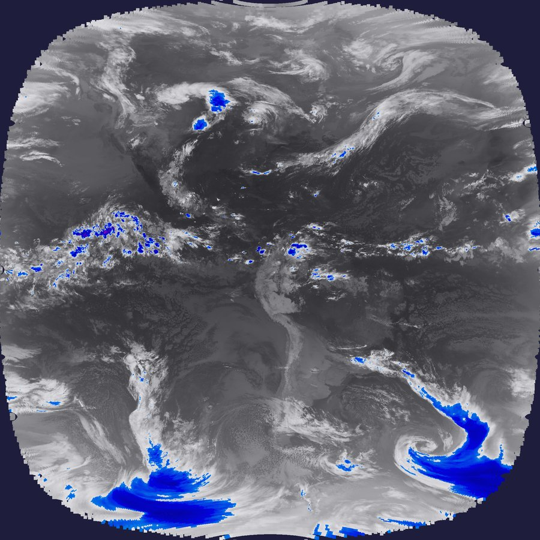
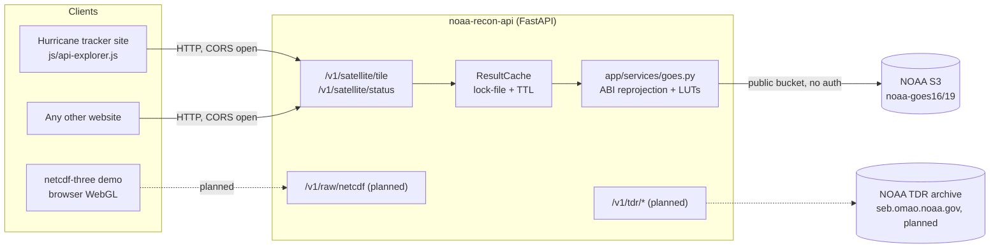
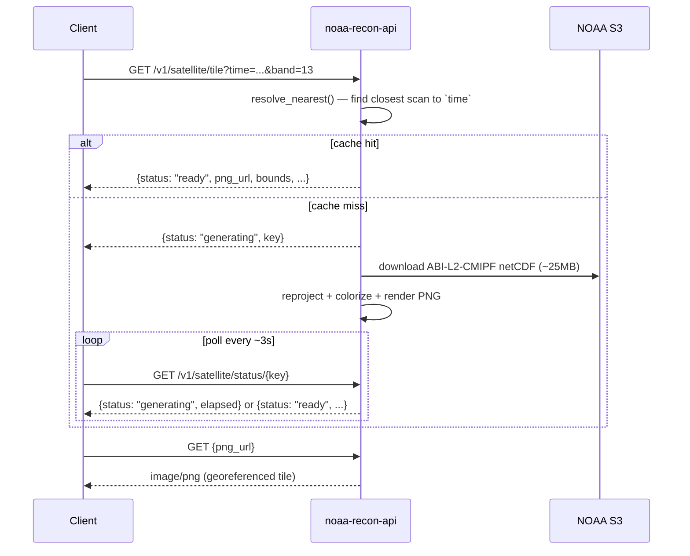

# noaa-recon-api
.
Open-source API for archival GOES satellite imagery (Band 13 IR, Band 2
visible, GeoColor) and NOAA Tail Doppler Radar (TDR) data, with a raw-netCDF
passthrough for client-side rendering. Built for a hurricane tracker site
but designed to be called from any website — CORS-open, no auth, no API key.

**Status:** MVP. `GET /v1/satellite/tile` (GOES Band 13/9 IR/WV archive) is
fully implemented and verified against live NOAA data, including:
- `cmap=default` (the recommended default) resolves server-side to the correct **per-band** standard enhancement — `abi13` for Band 13, `abi9` for Band 9 — built from exact temperature→hex stops, since these two bands measure different physical quantities and aren't interchangeable. `ir4` (an alternate Band 13 table cited from satpy + ColorBrewer) is also available — see API.md.
- `center`+`dims` bounding-box requests that render a fast, high-detail crop instead of the slow/coarse full disk (~11x faster processing, ~130x smaller file for a 500km box — measured, see API.md),
- always-native-resolution rendering plus a smoothing pass that reduces the blocky look of the forward-projection paint step (the sensor's native ~2km/px is a hardware ceiling no processing changes — see API.md's bbox section).

Band 2/GeoColor, TDR, and the raw-netCDF passthrough are stubbed
(`501 Not Implemented`) pending follow-up phases — see "Roadmap" below.

**📖 Full endpoint reference + integration examples (curl/JS/Python): [API.md](API.md)**
**🤖 Agent-readable summary: [llms.txt](llms.txt)** (also served live at `{base}/llms.txt`)

---

## What it produces

A `GET /v1/satellite/tile` request for an arbitrary UTC timestamp resolves
the nearest real GOES scan, downloads it from NOAA S3, reprojects ABI Fixed
Grid → EPSG:4326, and renders a georeferenced PNG — this is real output from
the live API (GOES-19, Band 13, BD color table):



## Architecture



## Request flow (satellite tile)



---

## Try the live API right now

No setup needed — it's already deployed:

```bash
curl "https://joshmurdock.net/api/v1/satellite/tile?time=$(date -u +%FT%TZ)&band=13&cmap=default"
```

See [API.md](API.md) for the full reference and curl/JavaScript/Python
integration examples.

---

## Human setup

```bash
git clone --recurse-submodules <this-repo-url>
cd noaa-recon-api
python3 -m venv .venv
source .venv/bin/activate
pip install -e ".[dev]"

uvicorn app.main:app --reload
# -> http://127.0.0.1:8000/docs   (Swagger UI, full endpoint surface)
```

Already cloned without `--recurse-submodules`? Run `git submodule update --init`.

Try it:

```bash
curl "http://127.0.0.1:8000/v1/satellite/tile?time=2024-09-28T12:00:00Z&band=13&cmap=default"
# -> {"status": "generating", "key": "goes_13_abi13_..."}
curl "http://127.0.0.1:8000/v1/satellite/status/<key>"
# -> poll until {"status": "ready", "png_url": "/cache/satellite/<key>.png", "bounds": [[lat,lon],[lat,lon]], ...}
```

### Tests

```bash
pytest                                          # offline unit tests (math, LUTs, parsing)
NOAA_RECON_API_NETWORK_TESTS=1 pytest           # + a live end-to-end render against NOAA S3
```

### Docker

```bash
docker compose up --build
```

### Deploying on this host (joshmurdock.net)

*Already done — this is documented for reference / redeploying after a host
rebuild. The live API is at `https://joshmurdock.net/api`.*

1. `python3 -m venv .venv && pip install -e .` as above.
2. Copy `deploy/noaa-recon-api.service` to `/etc/systemd/system/`, then
   `systemctl daemon-reload && systemctl enable --now noaa-recon-api.service`.
3. Paste the block from `deploy/nginx-snippet.conf` into the `joshmurdock.net`
   `server {}` block in `/etc/nginx/nginx.conf`, then `nginx -t && systemctl
   reload nginx`. This makes the API reachable at `/api/...` on the
   hurricanes site, same-origin (no CORS needed for that consumer; CORS is
   still open for other sites hitting the API directly).

### netcdf-three demo client

`clients/netcdf-three-demo/index.html` is a static page (no build step) that
proves the raw-netCDF → browser-rendering path end-to-end using the
[netcdf-three](https://github.com/umrlastig/netcdf-three) library, vendored
as a git submodule at `clients/netcdf-three-demo/vendor/netcdf-three`.

```bash
cd clients/netcdf-three-demo
python3 -m http.server 8765
# -> open http://127.0.0.1:8765/ in a browser
```

It defaults to the sample dataset bundled with the netcdf-three submodule.
**This has been verified to serve correctly (all assets return 200, the
sample file parses and contains real 3D variables) but has not been visually
verified in an actual browser** — there's no display/headless-browser
available in the environment this was built in. Open it in a real browser
and confirm the volume actually renders before relying on it.

---

## Agentic instructions

This section is for an AI agent picking up one of the roadmap items below
without re-deriving the architecture.

### Repo shape

```
app/
  main.py            FastAPI app, CORS (open — this API is meant for other sites too), router includes,
                      /cache + /demo/netcdf-three static mounts, GET /llms.txt
  paths.py            CACHE_ROOT = <repo>/cache, REPO_ROOT
  models.py            Pydantic response schemas
  routers/
    satellite.py       GET /v1/satellite/tile, GET /v1/satellite/status/{key}  — IMPLEMENTED
    tdr.py              GET /v1/tdr/missions, GET /v1/tdr/sweep                — STUB (501)
    raw.py              GET /v1/raw/netcdf                                     — STUB (501)
    health.py           GET /v1/health
  services/
    goes.py             Ported from the hurricanes site's goes_tile.py: ABI Fixed Grid reprojection
                         (PUG Vol 5 Sec 4.2), 7 color LUTs incl. the per-band "default ABI" tables
                         (abi13, abi9 — see DEFAULT_CMAP_BY_BAND) and the cited-source `ir4`, S3
                         download, PNG render. Adds resolve_nearest() for true ~10-min resolution
                         (picks the closest scan to an arbitrary timestamp, not just "first file
                         in the hour"), and render_bbox_to_png() — a two-pass sparse-locate +
                         native-resolution-crop renderer for center+dims requests (see
                         render_to_png() for the original full-disk path, unchanged).
    cache.py            ResultCache: lock-file + TTL pattern (mirrors proxy.php's approach),
                         driven by FastAPI BackgroundTasks instead of subprocess/nohup.
    tdr.py              Empty stub — see its docstring for the planned crawler/parse/render shape.
clients/netcdf-three-demo/   Static demo client (see "netcdf-three demo client" above)
deploy/                       nginx snippet + systemd unit for this host
docs/assets/                  README example image(s)
tests/test_satellite.py       Offline math/parsing tests + one network-gated e2e test
API.md                        Full human+agent endpoint reference, kept in sync with routers/ by hand —
                               if you add/change an endpoint, update this file and llms.txt in the same change.
llms.txt                      Terse agent-discovery summary (llmstxt.org convention); also served live at
                               GET /llms.txt (app/main.py) — keep both in sync with reality, not aspiration.
```

### Real bugs already found and fixed here

1. The original `goes_tile.py` (and by extension this port, before the fix) had
`Sx` defined with the wrong sign in `abi_to_latlon()`, which silently rotates
every computed longitude by 180° — `lat` is unaffected (it only depends on
`Sx**2`) so it's easy to miss, but it makes the renderer paint ~0% of pixels
onto the output grid (everything lands outside the expected `[lon_W, lon_E]`
window) and produce a blank tile. Fixed here by computing
`Sx = H - rs*cos(x)*cos(y)` per PUG Vol 5 Sec 4.2 (not `rs*cos(x)*cos(y) - H`).
**The same bug likely exists in the live hurricanes site's `goes_tile.py`** —
this was not yet fixed there as of this writing; flag it to a human before
touching that file, since it's in active production use.
`tests/test_satellite.py::test_abi_to_latlon_subsatellite_point_is_origin`
guards against a regression.

2. `abi13`/`abi9` were originally built through the same shared 256-bucket
LUT system (`_build_lut`/`_t2i`/`_i2t`) as the other colortables, which
quantizes the full temperature range into ~0.6°C steps. That's fine for
smooth gradients, but `abi13`'s source data has a deliberate 1°C-wide hard
cut (cyan@-32°C → light grey@-31°C) which quantization smeared into a
muddy blended color that doesn't exist in the source palette, and the LUT's
fixed -113..+42°C window clamped `abi13`'s warm end (needs up to +57°C)
before it ever reached true black. Fixed by evaluating `abi13`/`abi9`
exactly, per-pixel, via `_apply_stops_exact()` (vectorized `np.interp`)
instead of routing them through the shared LUT — see the comment above
`LUTS` in `app/services/goes.py`. `tests/test_satellite.py::test_apply_stops_exact_matches_direct_function_with_no_quantization`
guards against a regression. **If you add another colortable with a sharp
transition or a range outside ~-113..+42°C, add it to `STOPS_BY_CMAP`
instead of `LUTS`, not the other way around.**

### Roadmap (not yet implemented)

1. **Band 2 (visible) / GeoColor** satellite products — `app/services/goes.py`
   currently only handles single-band brightness-temperature LUTs (bands 9/13).
   Visible/RGB composite products need different processing (reflectance,
   not brightness temperature; GeoColor blends multiple bands/products).
2. **TDR**: see `app/services/tdr.py` docstring. In short: crawl
   `https://seb.omao.noaa.gov/pub/acdata/{year}/` for `YYYYMMDD[N|I|H]#/`
   mission directories (no manifest exists — build a local index, e.g.
   SQLite), download/extract the `.tar.gz` bundles in each mission's
   `RADAR_TDR/`, parse the raw netCDF sweeps (variable/dimension layout not
   yet inspected from a real file as of this writing), and render to the
   same storm-relative grid + Plotly-colorscale shape the hurricanes site's
   `js/tdr-archive.js` already consumes from TC-Atlas (match that response
   shape so the client needs minimal changes when migrated onto this API).
3. **Raw netCDF passthrough** (`app/routers/raw.py`): for the GOES side this
   can subset directly from the same file `goes.py` already downloads (no new
   data source) — implement as a `netCDF4` variable slice by
   center/dimensions, streamed back with `Content-Type: application/x-netcdf`.
   The TDR side depends on (2) above.
4. **Migrate the hurricanes site's `goes-archive.js`/`tdr-archive.js`** onto
   this API instead of the local `goes_tile.py` subprocess / TC-Atlas proxy
   — not done in the MVP since those already work in production; this is a
   deliberate follow-up, not an oversight.
5. Push to a GitHub remote (user-supplied) and move off this host into its
   own container — `Dockerfile`/`docker-compose.yml` already exist for this.

### Conventions to keep

- CORS stays open (`allow_origins=["*"]`) — this is meant for third-party
  sites, not just the hurricanes site.
- New endpoints should return the same `{status, ...}` shape pattern as
  `satellite.py` (`ready|generating|error|idle`) for anything that does
  background work, so polling clients have one contract to handle.
- Keep dependencies minimal — no rasterio/pyproj/boto3/satpy/metpy, matching
  the constraint the original `goes_tile.py` was built under (plain
  `netCDF4`/`numpy`/`Pillow`/stdlib + `httpx` for async HTTP).

## License

MIT — see `LICENSE`.
