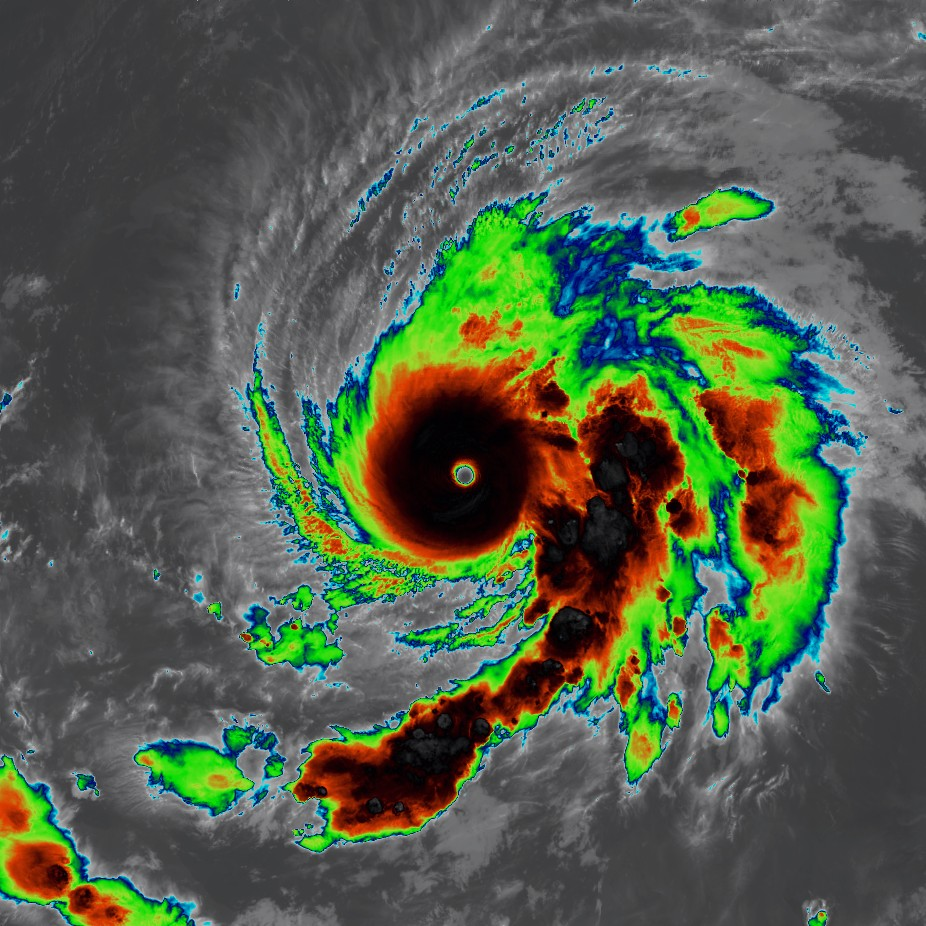
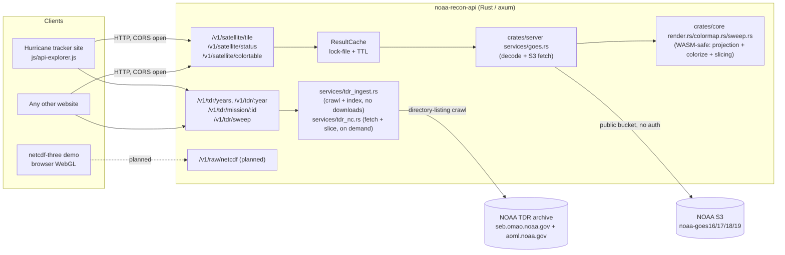
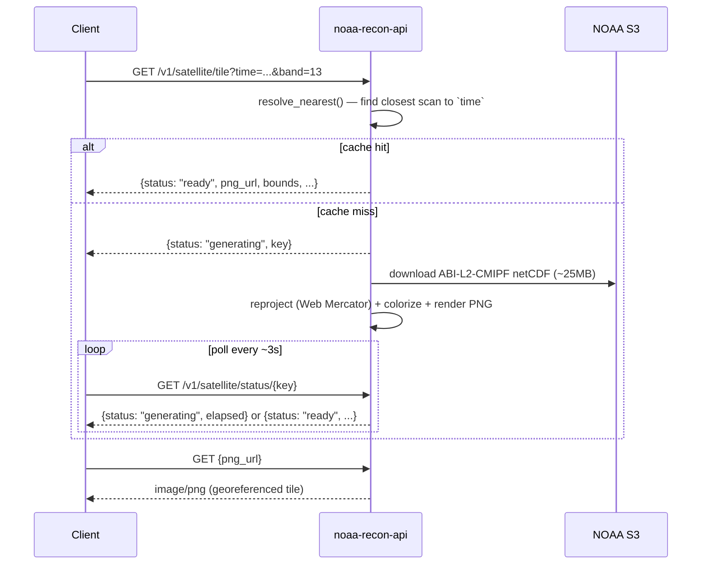
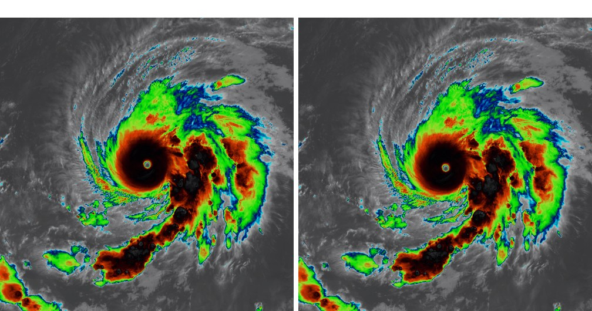

# NOAA Satellite, Recon, and Hurricane API

**Open-source HTTP API for archival GOES satellite imagery, NOAA Tail
Doppler Radar data, storm tracks, and aircraft reconaissance data.**

[](http://creativecommons.org/publicdomain/zero/1.0/)
[](https://joshmurdock.net/api/docs)

**[API.md](API.md)** — full endpoint reference

**[llms.txt](llms.txt)** — terse agent-discovery summary, also served
live at `{base}/llms.txt`

> **This is the `rust` branch.** The API server and all data ingest are a
> ground-up Rust rewrite (axum + a WASM-safe compute core) of the original
> Python/FastAPI implementation on `main` — same HTTP API surface, native
> binary instead of a Python process. One gap versus `main` today: two
> admin-console jobs (bulk prefetch, on-demand archive-update) aren't wired
> up yet. Everything else — all satellite imagery (every band, both
> composites), all data ingest (native subcommands, zero Python anywhere in
> this tree), and self-update — works and is verified against live NOAA
> data. Full port status, build recipe, and known-issue details:
> **[RUST.md](RUST.md)**.


Output from `GET /v1/satellite/tile` — GOES-19, Band 13 (Clean
Longwave IR), the `abi13` standard enhancement, a 1000 nautical-mile box
centered on the storm (17.55°N, 78.14°W, 2025-10-28 12:00 UTC):



Hurricane Melissa (2025)

```bash
curl "https://joshmurdock.net/api/v1/satellite/tile?time=2025-10-28T12:00:00Z&band=13&center=17.55,-78.14&dims=1000&unit=nm"
```

## What this API does

- **Archival GOES satellite tiles on demand.** Give it any UTC timestamp
  (not just hourly buckets) and it finds the nearest real ABI scan
  (~10-minute cadence), downloads it from NOAA's public S3 archive,
  reprojects it, and returns a georeferenced PNG ready to drop onto a
  Leaflet map.
- **Both GOES-East and GOES-West**, auto-resolved to the correct satellite
  (GOES-16/19 East, GOES-17/18 West) for the requested date — covers the
  full ABI era (~2017-2018 onward). Pre-ABI storms (e.g. Katrina, 2005)
  aren't reachable this way; see "Satellite coverage" in API.md for why.
- **The correct color table for the band you asked for.** `cmap=default`
  resolves to the right per-band standard enhancement — `abi13` (Clean
  IR), `abi9` (water vapor), `abi7` (shortwave IR / "fire temperature"),
  `abi5` (near-IR reflectance), `abi3` (Veggie/vegetation reflectance), or
  `abi2` (red/visible reflectance) — built from exact temperature→color
  stops (or a reflectance ramp for bands 2/3/5), not a generic
  approximation. See ["How the imagery is
  processed"](#how-the-imagery-is-processed) below for exactly how each
  one is computed, and [the live color legend tool](#color-legend) for
  rendering one client-side.
- **Composite products**: `product=sandwich` (Band 13 IR modulated by
  Band 2 visible texture) and `product=geocolor` (a documented
  approximation of NOAA's day/night true-color+IR composite — see
  ["How the imagery is processed"](#how-the-imagery-is-processed) below
  for the exact blend formulas, or `GET /v1/satellite/products` for a
  machine-readable summary). Both support `center`/`dims` bbox cropping
  the same as a single-band tile.
- **`GET /v1/satellite/products`** — discovery endpoint listing every band/
  product this API can render and the exact UTC date range each satellite
  covers, so a client can build a picker without hardcoding any of that.
- **Fast, high-detail regional crops.** Pass `center` + `dims` (km or
  nautical miles) instead of rendering the slow, coarse full disk —
  ~11x faster, ~130x smaller files, at the sensor's native ~2km/pixel
  resolution by default.
- **Correctly georeferenced for web maps.** Output rows are spaced in Web
  Mercator, matching how Leaflet/Google Maps/every standard web map
  actually projects the earth — see "Real bugs found and fixed" below.
- **A raw-netCDF path for client-side rendering** (in progress) feeding a
  Three.js/WebGL volumetric viewer, for users who want the data itself
  rather than a pre-rendered image.
- **Historical storm tracks, named storms only.** Feed a year, storm
  name, and any UTC datetime and get back the closest actual best-track
  fix — lat/lon, Saffir-Simpson category, wind, and pressure. Backed by
  NHC's HURDAT2 archive (Atlantic + East/Central Pacific since 1950) for
  the reconciled historical record, plus NHC's operational ATCF b-decks to
  bridge the gap up through the storm happening right now — kept current
  by a nightly systemd timer. Plus discovery endpoints for what
  years/storms are on record. See `GET /v1/storms/*` in API.md and "Storm
  archive updates" below.
- **Recon MET archive — every hurricane hunter flight since 2011.**
  Look up archived flight-level observation data (position, wind,
  SFMR surface wind, altitude) by year and storm name, then fetch one
  mission by `mission_id` — decimated data inline for quick plotting, or
  `GET /v1/recon/mission/{id}/download` to stream NOAA's original
  full-resolution NetCDF file (600+ variables — attitude, airspeed, every
  raw sensor channel, not just the ~7 fields this project decimates).
  Same year/storm discovery shape as the storm-track archive, so the two
  can be cross-referenced from one API. Kept current by its own nightly
  systemd timer. See `GET /v1/recon/*` in API.md and "Recon MET archive" below.

---

# Installation

**Linux**

Utilize the following install script to automatically install the API on your hardware. The installer works on Fedora/RHEL/Rocky/CentOS (`dnf`), Debian/Ubuntu (`apt`), and NixOS (`nix`) distributions, and other distributions sharing one of these package managers.
This install script creates a fully-configured, self-updating instance, including dependencies, systemd service, nginx/Apache + SSL support for self-hosted domains, and the storm/recon archives.

```bash
bash -c "$(curl -fsSL https://raw.githubusercontent.com/jjmurdock19/noaa-recon-api/main/install.sh)"
```
See **[INSTALL.md](INSTALL.md)** for a plain-language walkthrough of each prompt from the install wizard, or the
["Manual setup"](#manual-setup) section below to do each step by hand.

**Windows**

The API can be deployed on Windows for local testing.

```powershell
irm https://raw.githubusercontent.com/jjmurdock19/noaa-recon-api/main/install.ps1 | iex
```

The API runs as a plain background process started/stopped by the user (`noaa-recon-api start`/`stop`). This is not a Windows
Service or login-autostart. See **[INSTALL.md](INSTALL.md#windows-local-testing)**.

### Requirements

The installer asks which version to install — **Rust** (this branch) or
**Python** (the `main` branch) — and installs only what that variant needs.

**Linux** — Fedora/RHEL/Rocky/CentOS, Debian/Ubuntu, or a distribution with the Nix
package manager (anything with `dnf`, `apt`, or `nix` on `PATH`), plus `sudo`
access so the installer can install packages and write system files (it does
not need to be run as `root`). Everything else is detected and installed
automatically if missing:

- **Rust variant** (this branch): git, a C compiler + `make`, `cmake`, and
  `curl` (to fetch `rustup`) — no Python at all. First build compiles
  netCDF-C + HDF5 from source (a few minutes); the installer handles the
  compiler-flag workaround newer GCC needs for that (see
  [RUST.md](RUST.md)).
- **Python variant** (`main` branch): git, Python 3.9+, and a C compiler
  (needed to build `netCDF4`'s C extensions).
- Either variant: optionally nginx/Apache + certbot for HTTPS.

**Windows** — git (installed via `winget` if missing and you approve it;
PowerShell is built in) plus, for the Rust variant, `rustup`+`cmake` the same
way. Local-testing scope only — no reverse proxy, domain, or HTTPS, see above.

### What the installer does

`install.sh` is a single self-contained Bash script — no external installer
framework or package to fetch beyond the script itself:

1. Asks which variant to install (Rust or Python) — or pass `--variant rust`/
   `--variant python` non-interactively.
2. Detects your package manager (`dnf`/`apt`/`nix`) and installs that
   variant's dependencies if any are missing.
3. Clones this repo (the `rust` or `main` branch, matching your variant) to an
   install directory of your choice (`/opt/noaa-recon-api` by default).
4. **Rust variant:** installs `rustup` and runs `cargo build --release` —
   the compiled binary is what the systemd service runs, no venv involved.
   **Python variant:** creates a virtualenv and installs the API's
   dependencies into it — isolated from system Python.
5. Writes and enables a **systemd service** so the API starts on boot and
   restarts itself if it crashes.
6. Optionally installs/configures **nginx or Apache** as a reverse proxy for
   a domain deployment, and can request a free **Let's Encrypt** HTTPS
   certificate via `certbot`.
7. Builds the storm-track and recon MET archives (SQLite databases under
   `data/`) and installs three nightly **systemd timers**: two to keep them
   current going forward, plus one to clear out stale cached netCDF files.
   (Rust variant: these run the compiled binary's `ingest-storms`/
   `ingest-recon`/`clean-nc-cache` subcommands directly.)
8. Installs a `noaa-recon-api` CLI command (`start`/`stop`/`status`/`logs`/
   `update`/`uninstall`) for living with the install afterward.

Re-running the same one-liner on a machine that already has it installed
offers **Update** (pull latest, rebuild, restart) or **Reconfigure** (re-run
the wizard with your previous answers pre-filled as defaults) instead of
installing a second copy. See [INSTALL.md](INSTALL.md) for a plain-language
walkthrough of every prompt the wizard asks (written against the Python
variant's prompts; the Rust variant asks the same questions minus the
Python-specific ones).

---

# Data Information


**Status:** Undergoing active development. Storm tracks, the recon archive
(read *and* ingest), single-band IR satellite tiles (bands 7/9/13), and the
full TDR pipeline (mission/file index, ingest, and sweep slice rendering)
are fully implemented and verified against live NOAA data on this branch.
Reflectance-band tiles (2/3/5) and the composite products are still in the
works, along with the raw-netCDF passthrough (`501 Not Implemented`) — see
"Roadmap" below. TDR sweep rendering covers both the post-2021 Cartesian
grid schema and the pre-2021 lons/lats-gridded schema — see "TDR archive"
below.

## Sources

All data served by this API is fetched and cached from publicly-accessible NOAA data sources. Exact
endpoints, for reproducibility and citation:

**GOES satellite imagery** — [NOAA GOES-R Series on AWS Open Data](https://registry.opendata.aws/noaa-goes/),
unauthenticated public S3 buckets. This API reads the `ABI-L2-CMIPF`
(Cloud and Moisture Imagery, Full Disk) product directly:
- East: [`noaa-goes16`](https://noaa-goes16.s3.amazonaws.com/) (2017-12-18 – 2025-01-14), [`noaa-goes19`](https://noaa-goes19.s3.amazonaws.com/) (2025-01-14 – present)
- West: [`noaa-goes17`](https://noaa-goes17.s3.amazonaws.com/) (2019-02-12 – 2023-01-10), [`noaa-goes18`](https://noaa-goes18.s3.amazonaws.com/) (2023-01-10 – present)
- Object path: `ABI-L2-CMIPF/{year}/{day-of-year}/{hour}/` within each bucket
  (see `get_satellite_bucket()` in `crates/server/src/services/goes.rs` for
  the exact cutover-date logic, and "Satellite coverage" in API.md for what's
  out of reach — pre-ABI storms like Katrina 2005 aren't in these buckets at all).

**Storm tracks** — [NHC (National Hurricane Center)](https://www.nhc.noaa.gov/):
- [HURDAT2](https://www.nhc.noaa.gov/data/#hurdat), the reconciled historical best-track database:
  [Atlantic, 1851–2024](https://www.nhc.noaa.gov/data/hurdat/hurdat2-1851-2024-040425.txt) and
  [East/Central Pacific, 1949–2023](https://www.nhc.noaa.gov/data/hurdat/hurdat2-nepac-1949-2023-042624.txt)
- [ATCF](https://ftp.nhc.noaa.gov/atcf/) (Automated Tropical Cyclone Forecasting) b-decks, which bridge the
  gap from HURDAT2's cutoff up through whatever's happening right now:
  [current season](https://ftp.nhc.noaa.gov/atcf/btk/) and
  [closed-season archive](https://ftp.nhc.noaa.gov/atcf/archive/) (per-year subdirectories)

**Recon MET archive** — [NOAA OMAO](https://www.omao.noaa.gov/)'s (Office of Marine and Aviation
Operations) Aircraft Operations Center raw data archive at
[`seb.omao.noaa.gov/pub/acdata`](https://seb.omao.noaa.gov/pub/acdata/), organized
`{year}/MET/{mission_id}/`. Every hurricane hunter flight since 2011: this
API decimates the QC'd 1-second flight-level NetCDF file (position, wind,
SFMR surface wind, altitude) to ~7 fields for quick plotting, and
`GET /v1/recon/mission/{id}/download` streams NOAA's original
full-resolution file (600+ variables) unmodified, straight from that same
archive.

**Tail Doppler Radar (TDR)** — two hosts, two QC lineages, same file-naming
convention (see the AOML "Guide to the TDR dataset" this was built
against): **Level 1b** (real-time, in-season) at
[`seb.omao.noaa.gov/pub/flight/radar`](https://seb.omao.noaa.gov/pub/flight/radar/),
flat mission directories with no manifest; **Level 2** (post-season, QC'd)
at
[`www.aoml.noaa.gov/ftp/pub/hrd/data/radar/level2`](https://www.aoml.noaa.gov/ftp/pub/hrd/data/radar/level2/),
organized `{year}/{storm_slug}/{mission_id}/`. This project indexes the
gridded analysis products from both (3D `xy` volumes, `vert_inbound`/
`vert_outbound` profiles, and their `_rel`/`_fall` variants) — not the raw
Level 1a Doppler sweeps, which would require reimplementing HRD's
variational Doppler synthesis algorithm rather than just serving already-
synthesized data. See `crates/server/src/services/tdr_ingest.rs` for the
crawler (no manifest exists at either host, so it walks the directory
listings the same way the recon MET crawler does) and "TDR archive" below
for ingest details.

## Imagery Processing

> On this branch, every ABI band (1-16) and both composite products
> (`sandwich`/`geocolor`) render. This section documents the full pipeline;
> where a piece exists only in the (still current, still
> deployed) Python implementation on `main`, it's called out.

Every tile goes through the same four stages, split across the WASM-safe
core and the native server (see "Repo shape" above) — no external
image-processing service involved:

1. **Fetch.** `resolve_nearest()` (`services/goes.rs`) picks the closest
   actual ABI scan to the requested `time` (~10-minute cadence), then
   downloads that scan's raw `ABI-L2-CMIPF` netCDF (~25MB per band)
   straight from NOAA's public S3 bucket — see "Data sources" above.
   Composites (`sandwich`, `geocolor`) fetch every companion band from that
   *same* scan cycle, since ABI captures all bands simultaneously and
   there's no time-misalignment to correct for.
2. **Reproject** (`crates/core/src/project.rs` + `render.rs`). Raw ABI data
   is on a satellite-fixed scan grid (radians from the sub-satellite
   point), not lat/lon. `abi_to_latlon()` converts it per the GOES-R
   Product User Guide's Volume 5 Section 4.2 formula, then each output row
   is spaced linearly in **Web Mercator Y** (`mercator_y()`), not linearly
   by latitude — because that's what `L.imageOverlay` and every standard
   web map actually assume when they stretch an image between two corner
   coordinates. Getting this wrong visibly mispositions the image (see bug
   #4 above); it's easy to get wrong because a plain equirectangular
   projection *looks* almost right at low latitudes and only clearly breaks
   near the poles or on a large box. Where multiple source pixels land on
   the same output cell (common — several hundred collisions on a typical
   crop), `paint_project()` deterministically keeps the coldest value,
   since that's the meteorologically significant one for cloud-top
   imagery, not whichever pixel got processed last.
3. **Colorize** — see the next section for exactly how each band/cmap gets
   its color.
4. **Encode.** The colorized array becomes an RGBA PNG: pixels with actual
   scan data get `alpha=220` (~86% opaque, so the base map still shows
   faintly through the overlay); off-disk or no-data pixels get
   `alpha=0` (fully transparent, so Leaflet never paints a hard edge
   where the satellite's view ends). Saved straight to the on-disk cache
   (`ResultCache`) that `/v1/satellite/status` and `png_url` read from.

### Color grading

`crates/core/src/render.rs`'s `colorize()` picks one of three strategies
depending on the band/cmap, and which one matters for accuracy:

- **Reflectance bands (2, 3, 5)** have no "temperature" — `reflectance_gray()`
  (`colormap.rs`) gamma-stretches the 0–1 reflectance factor (`refl **
  (1/1.5) * 255`) to a 0–100% grayscale ramp. Linear reflectance reads
  unnaturally dark/flat to the eye, so VIS/near-IR imagery is conventionally
  displayed gamma-stretched — the same idea (not a tuned match) as satpy's
  default reflectance enhancement.
- **`abi13`/`abi9`/`abi7`** (the recommended per-band default enhancements)
  are evaluated **exactly**, per-pixel, via `interp_stops()` over the
  literal temperature→color stops
  (`ABI13_STOPS`/`ABI9_STOPS`/`ABI7_STOPS` in `colormap.rs`) rather than
  through a quantized lookup table. This is deliberate, not an optimization
  detail: `abi13`'s source palette has a genuinely sharp 1°C-wide cut
  (cyan@-32°C → light grey@-31°C, marking the severe-convection threshold),
  and quantizing that into ~0.6°C buckets smears it into a muddy blended
  color that isn't in the source palette at all — see bug #2 above for the
  before/after. **If you add a colortable with a similarly sharp
  transition or a range outside ~-113..+42°C, add it to `stops_by_cmap()`,
  not `build_lut()`.**
- **Everything else** (`bd`, `enhanced`, `nrl`, `grayscale`, `ir4`) goes
  through a shared 256-entry LUT (`build_lut()`), built once by sampling
  each palette function every ~0.6°C across a fixed -113..+42°C window.
  Fine for palettes without a hard cut, cheaper than exact evaluation, but
  the fixed window means these clip anything warmer than +42°C to the same
  color — irrelevant for 9/13, but it silently loses Band 7's
  fire-highlighting range above that, which is exactly why `abi7` (not one
  of these) is Band 7's default.

`GET /v1/satellite/colortable` (below) reads these same structures
(`stops_by_cmap()`/`build_lut()`) at request time, so a legend built from it
is guaranteed to match what a render actually produced — not a hand-copied
approximation that can drift out of sync.

> The composite formulas below are described in terms of the Python
> implementation on `main` (`render_sandwich_to_png()`, `_solar_zenith_deg()`,
> etc.) — the algorithm is unchanged in the Rust port
> (`render_sandwich()`/`render_geocolor()` in `crates/core/src/render.rs`).

**`product=sandwich`** 
`render_sandwich_to_png()` colorizes Band 13 with the exact `abi13`
enhancement, then **multiplies** every pixel's RGB by a brightness factor
derived from Band 2 (visible) reflectance: `brightness = 0.35 + 0.65 *
clip(vis_reflectance, 0, 1)`. Fully sunlit, high-reflectance cloud tops
(fresh overshooting tops, gravity waves) stay near full IR color;
low-reflectance areas darken toward 35% — enough to reveal visible-light
texture the IR channel alone smooths over, without ever fully hiding the
underlying IR colorization. At night (or wherever Band 2 has no data for
the requested crop, e.g. right at the scan's limb), there's no visible
signal to modulate with, so it falls back to a flat 0.35 brightness — a
uniformly darkened plain-IR look, matching how real sandwich products
behave outside daylight rather than hiding the night side entirely.

**`product=geocolor`** 

`render_geocolor_to_png()` is an explicitly-labeled **approximation**,
not NOAA/CIRA's proprietary GeoColor algorithm (that includes full
atmospheric/Rayleigh correction and a static city-lights layer this
project has no access to). What it does instead:

- **Day:** synthetic true color from Bands 1 (blue) / 2 (red) / 3
  (veggie/NIR) reflectance. ABI has no native green channel, so green is
  synthesized with CIRA's published recipe
  `green = 0.45*red + 0.10*NIR + 0.45*blue`, the same formula behind most
  open-source ABI "true color" composites (e.g. satpy's).
- **Night:** the standard `abi13` colorized IR, identical to the
  standalone Band 13 product.
- **Terminator blend:** `_solar_zenith_deg()` computes a low-precision
  per-pixel solar zenith angle (NOAA/Spencer Fourier-series approximation
  — public-domain, the same formula behind NOAA's online solar
  calculator; accurate to a fraction of a degree, plenty for a
  several-degree-wide blend, not ephemeris-grade). Full day color inside
  ~85° zenith, full night IR beyond ~95°, linearly blended across that
  ~10° terminator band in between.
- **Missing versus true Geocolor:** no city-lights, no
  aerosol/Rayleigh atmospheric correction.

Both composites crop and read each companion band directly from its
source file at a stride for a bbox request (`_read_source_cropped()`)
rather than materializing the full disk first — see bug #6 below for why
that matters (Band 2 at native 0.5km resolution is large enough to OOM a
small deployment host if read whole).

## Colortables

`GET /v1/satellite/colortable` returns the exact colortable used to render a product, giving the end user the power to create an exact-copy legend. Default colortables are sources from the ABI colortables.

```bash
curl "https://joshmurdock.net/api/v1/satellite/colortable?cmap=default&band=13"
```

`GET /v1/satellite/colortables?band=13` (plural) lists every color table
usable with a given band — names, descriptions, and which one's the
default — for building a picker UI without hardcoding the cmap catalog
client-side; `?product=sandwich`/`geocolor` returns the single fixed
enhancement a composite uses instead, since composites don't take a
`cmap` choice. See API.md for both.

---

# Architecture



## Request flow (satellite tile)



---

## Manual setup

*Deploying to a server and want the systemd service, nginx/HTTPS, and
archives set up for you instead? Use `./install.sh` — see
[INSTALL.md](INSTALL.md) or "Deploy your own copy" above. What follows
is the same thing done by hand, step by step, for local dev or anyone
who wants full manual control.*

```bash
git clone --recurse-submodules --branch rust <this-repo-url>
cd noaa-recon-api
cargo build --release -p noaa-recon-api
PORT=8000 ./target/release/noaa-recon-api
# -> http://127.0.0.1:8000/       (admin console — see below)
```

The **first** build compiles netCDF-C + HDF5 from source and needs `cmake`
plus a compiler-flag workaround on some GCC versions — see
[RUST.md](RUST.md) for the exact `CFLAGS`/toolchain setup (the installer
handles this for you; only matters for a from-scratch manual build).

Already cloned without `--recurse-submodules`? Run `git submodule update --init`.

Try it:

```bash
curl "http://127.0.0.1:8000/v1/satellite/tile?time=2024-09-28T12:00:00Z&band=13"
# -> {"status": "generating", "key": "goes_13_abi13_..."}
curl "http://127.0.0.1:8000/v1/satellite/status/<key>"
# -> poll until {"status": "ready", "png_url": "/cache/satellite/<key>.png", "bounds": [[lat,lon],[lat,lon]], ...}
```

There's no auto-generated Swagger UI (that was a FastAPI feature) — see
[API.md](API.md) for the full endpoint reference instead.

### Tests

```bash
cargo test --workspace
```

### Docker

```bash
docker compose up --build
```

Multi-stage build: compiles the release binary (`rust:1-bookworm`, needs
`cmake` for the netCDF/HDF5 static build), then copies just the binary +
`app/console/` into a slim `debian:bookworm-slim` runtime image. Ingest is a
subcommand — run `docker compose run api noaa-recon-api ingest-storms` (etc.)
against the running container's volumes, or wire it into your own scheduler.

### Deploying (fresh host, building both archives from scratch)

*`./install.sh` does everything below automatically, including asking
whether to build the full recon archive or the fast current-season-only
version. This section is the manual equivalent, for anyone not using it.*

Both `GET /v1/storms/*` and `GET /v1/recon/*` are backed by local SQLite
databases under `data/` (gitignored — not part of the repo, built by the
ingest subcommands below). A brand-new deployment has neither database yet;
build both once, then install the nightly timers so they stay current
without further attention:

```bash
# Storms: always does a full HURDAT2 + ATCF backfill automatically (fast, ~10s)
./target/release/noaa-recon-api ingest-storms

# Recon MET: --full crawls every year since 2011 from scratch — this is
# thousands of small requests plus large NetCDF downloads and PDF parses,
# expect this to take HOURS on a fresh deployment (the nightly default,
# current + previous year only, is what runs afterward and is quick)
./target/release/noaa-recon-api ingest-recon --full
```

Then install both nightly timers (details in the two sections below) so
each archive keeps itself current going forward without manual re-runs.

`GET /v1/tdr/*` is a separate archive (`data/tdr.sqlite`, `ingest-tdr`) —
not yet wired into `install.sh`'s automatic setup, so build and time it by
hand for now (see "TDR archive" below); it's lighter than the recon
backfill since it only indexes file metadata, never downloads a netCDF
file.

### Storm archive updates

`data/storms.sqlite` (the `GET /v1/storms/*` backing store) is populated by
the `ingest-storms` subcommand — see
[`crates/server/src/services/storms.rs`](crates/server/src/services/storms.rs)
(the `INGEST` section) for the HURDAT2 + ATCF b-deck pipeline. Run it
manually any time:

```bash
./target/release/noaa-recon-api ingest-storms
```

To keep it current automatically (picks up the latest advisory for any
storm active right now), install the nightly timer — the *service* unit is
generated by `install.sh` (or write your own `ExecStart=.../noaa-recon-api
ingest-storms`); the *timer* schedule ships in the repo:

```bash
sudo cp deploy/storm-archive-update.timer /etc/systemd/system/
sudo systemctl daemon-reload
sudo systemctl enable --now storm-archive-update.timer
```

Fires nightly at 03:15 (server local time); `Persistent=true` means a
missed run (host was down) fires on next boot instead of waiting a full
day. Visible in Cockpit's Services page like any other systemd unit —
search "storm-archive-update" to check last-run status.

### Recon MET archive

`data/recon_met.sqlite` (the `GET /v1/recon/*` backing store) is populated
by the `ingest-recon` subcommand — see
[`crates/server/src/services/recon_ingest.rs`](crates/server/src/services/recon_ingest.rs)
for the crawl/decode/reconciliation pipeline (NOAA's raw 1-second
flight-level data at `seb.omao.noaa.gov`, decimated and stored at 0.2 Hz).
Run it manually any time:

```bash
./target/release/noaa-recon-api ingest-recon                    # current + previous year (nightly default)
./target/release/noaa-recon-api ingest-recon --full              # every year since 2011 — see the warning above
./target/release/noaa-recon-api ingest-recon --years 2024        # one year only
./target/release/noaa-recon-api ingest-recon --force              # re-harvest even unchanged missions
```

Idempotent: each mission is skipped unless its QC version on the server
changed, so a nightly re-run only does real work for new/upgraded
missions. Install the nightly timer the same way:

```bash
sudo cp deploy/recon-met-update.timer /etc/systemd/system/
sudo systemctl daemon-reload
sudo systemctl enable --now recon-met-update.timer
```

Fires nightly at 03:45 (30 minutes after the storm archive timer, so the
two crawls don't compete for network/CPU at the same instant);
`Persistent=true` for the same missed-run-catches-up-on-boot behavior.
Also visible in Cockpit's Services page (search "recon-met-update").

### TDR archive

`data/tdr.sqlite` (the `GET /v1/tdr/*` backing store) is populated by the
`ingest-tdr` subcommand — see
[`crates/server/src/services/tdr_ingest.rs`](crates/server/src/services/tdr_ingest.rs)
for the Level 1b + Level 2 crawler. Unlike the recon MET archive, this
phase never downloads a netCDF file — it only indexes mission → product →
source-URL metadata (a mission can have a dozen multi-MB analysis grids;
bulk-downloading all of them during ingest would be exactly the kind of
server load this project avoids). Run it manually any time:

```bash
./target/release/noaa-recon-api ingest-tdr                    # current + previous year (nightly default)
./target/release/noaa-recon-api ingest-tdr --full              # every year since 2011 — see the recon warning above
./target/release/noaa-recon-api ingest-tdr --years 2024        # one year only
./target/release/noaa-recon-api ingest-tdr --force              # re-crawl a mission's file listing even if already indexed
```

Idempotent: a mission already indexed at a given level is skipped (no HTTP
request against its file listing) unless `--force`, so a nightly re-run
only does real work for new missions. Install the nightly timer the same
way:

```bash
sudo cp deploy/tdr-update.timer /etc/systemd/system/
sudo systemctl daemon-reload
sudo systemctl enable --now tdr-update.timer
```

Fires nightly at 04:00 (between the recon MET timer at 03:45 and the GOES
cache-cleanup timer at 04:15); `Persistent=true` for the same missed-run-
catches-up-on-boot behavior. Also visible in Cockpit's Services page
(search "tdr-update").

### GOES netCDF cache cleanup

`cache/goes_nc/` holds the raw netCDF scans downloaded from S3 before
rendering — they're re-fetched on demand, so nothing is lost by deleting
old ones. Run the cleanup manually any time:

```bash
./target/release/noaa-recon-api clean-nc-cache                       # delete files older than 24h
./target/release/noaa-recon-api clean-nc-cache --max-age-hours 48    # different cutoff
```

Install the nightly timer to keep the cache trimmed automatically:

```bash
sudo cp deploy/goes-nc-cache-cleanup.timer /etc/systemd/system/
sudo systemctl daemon-reload
sudo systemctl enable --now goes-nc-cache-cleanup.timer
```

Fires nightly at 04:15 (after both archive-update timers), deleting any
cached netCDF file older than 1 day. `Persistent=true` for the same
missed-run-catches-up-on-boot behavior as the other timers. Also visible
in Cockpit's Services page (search "goes-nc-cache-cleanup").

`./install.sh` wires all three of the above up automatically (it generates
the matching `.service` unit for each timer and points `ExecStart` at your
build's binary) — the commands above are for manual/non-installer setups.

### Admin console

Visiting the API's root (`/` locally) serves a login-gated admin console —
status/cache stats, browsing and deleting cached rendered tiles and raw
netCDF downloads, and a "Databases" panel with size/record-count cards for
the storm-track and recon MET archives. Self-update (check for a new commit,
pull + rebuild + restart) is ported and works. **Not yet ported on this
branch:** the bulk-prefetch-a-timeframe job and the per-archive "force
update" buttons still return `501` (the console UI shows them, but they
don't work yet — see [RUST.md](RUST.md)). Run the ingest subcommands above
by hand or via the nightly timer instead for now.

Every console user has their own account with one of two roles (see
"API tokens & accounts" below for how they're created):

- **superuser** — everything, including account/token management and
  triggering self-update.
- **moderator** — everything except account/token management and
  self-update — cache, logs, databases, archive-rebuild triggers, and the
  usage log.

The very first account is bootstrapped automatically the first time the
app starts: **`admin_credentials.json`** at the repo root (gitignored,
created with `admin`/`password` defaults on first run if missing — the
installer always generates a real password instead, see INSTALL.md)
becomes the first superuser, with its plaintext password re-hashed into
the same PBKDF2 scheme
([`crates/server/src/services/tokens.rs`](crates/server/src/services/tokens.rs)'s
`migrate_legacy_admin_credentials()` — a one-time-idempotent fixup, same
pattern as `recon_ingest.rs`'s `migrate_*`/`reconcile_*` functions). That
file's `secret_key` is still what signs the session cookie (a signed
cookie via `axum-extra`'s `SignedCookieJar` — same idea as Starlette's
`SessionMiddleware` on the Python branch, not byte-compatible with it) —
it's no longer the active credential store once at least one account
exists, so editing the username/password in it after that point has no
effect; manage accounts from the console's API management pane (or
directly against `data/auth.sqlite`) instead.

The console itself is a static page (`app/console/index.html`, no build
step, unchanged from the Python branch) that calls the JSON endpoints
under `/v1/admin/*` (see API.md).

### API tokens & accounts

Off by default. A deployer can require an `Authorization: Bearer <token>`
header on every public `/v1/*` data call (satellite/storms/recon/tdr/raw —
`/v1/health` and the admin console always stay open) — useful for tracking
or restricting who's calling your instance. Toggle it at install time (the
installer asks) or later from the console's API management pane
(superuser only) — takes effect immediately, no restart.

Three roles, one `tokens` table (`data/auth.sqlite`, same schema as the
Python branch — see
[`crates/server/src/services/tokens.rs`](crates/server/src/services/tokens.rs)):

- **regular** — a plain API key. No console login, tracked in the usage
  log by owner name.
- **moderator** / **superuser** — a console username+password *and* an API
  key (the same token doubles as both — a superuser calling the public API
  programmatically uses their own token same as anyone else).

Token secrets are high-entropy (32 random bytes, URL-safe base64) and
stored as a fast hash (SHA-256) — safe to look up on every request without
a slow KDF, since brute-forcing a 32-byte random value is infeasible
regardless of hash speed. Passwords are human-chosen and lower-entropy, so
those get a proper slow KDF (PBKDF2-HMAC-SHA256, 310k iterations, OWASP's
current baseline) — byte-for-byte the same hashing scheme as the Python
branch, so `data/auth.sqlite` is portable between the two. A raw
token/password is only ever shown once, at creation or regeneration time,
exactly like a GitHub PAT.

Every console login attempt (success or failure) lands in the login log;
every authenticated public-API call lands in the usage log — both
denormalize the owner name/role/username onto each row rather than only
storing a foreign key, so history stays meaningful even after a token is
deleted.

### netcdf-three demo client

`clients/netcdf-three-demo/index.html` is a static page (no build step) that
proves the raw-netCDF → browser-rendering path end-to-end using the
[netcdf-three](https://github.com/umrlastig/netcdf-three) library, vendored
as a git submodule at `clients/netcdf-three-demo/vendor/netcdf-three`.

It's a static page — serve `clients/netcdf-three-demo/` with any web server
(it needs one, not a `file://` open, since it fetches its sample dataset via
`fetch()`). E.g. with the Rust binary itself, or any static-file server you
have on hand:

```bash
npx serve clients/netcdf-three-demo -l 8765
# -> open http://127.0.0.1:8765/ in a browser
```

It defaults to the sample dataset bundled with the netcdf-three submodule.
**This has been verified to serve correctly (all assets return 200, the
sample file parses and contains real 3D variables) but has not been visually
verified in an actual browser** — there's no display/headless-browser
available in the environment this was built in. Open it in a real browser
and confirm the volume actually renders before relying on it.

---

## Agentic instructions

This section is for an AI agent picking up one of the roadmap items below
without re-deriving the architecture.

### Repo shape

This branch is a Cargo **workspace** split so the compute core can also
target WASM later — `crates/core` has zero I/O and zero C dependencies
(no tokio, no rusqlite, no netcdf-C), so it compiles to `wasm32-unknown-
unknown` as well as native; `crates/server` wraps it with everything that
needs the OS (filesystem, SQLite, HTTP, the netCDF-C decode). See
[RUST.md](RUST.md) for the full build recipe and current port status.

```
crates/
  core/                        noaa-recon-core — WASM-safe compute, no I/O, no C deps
    src/
      lib.rs
      models.rs                  TileStatus/TileState (serde port of the old Pydantic models.py)
      colormap.rs                 Every colortable: LUT-based (bd/enhanced/nrl/grayscale/ir4) AND
                                   exact-stops (abi13/abi9/abi7 — evaluated per-pixel, no LUT
                                   quantization, same reasoning as "Real bugs" #2 below) plus the
                                   reflectance-band gamma-stretch ramp.
      catalog.rs                   Band/cmap/product validity + per-band defaults + native GSD.
      bbox.rs                       Bounding-box request validation/clamping + geometry helpers shared
                                   by the server's netcdf crop-locate step and the render step.
      project.rs                    ABI Fixed Grid -> lat/lon (abi_to_latlon, PUG Vol 5 Sec 4.2) +
                                   Web Mercator row spacing (mercator_y) — see "Real bugs" #1/#4 below.
      render.rs                     The pure-math render pipeline: collision-safe forward-paint
                                   (paint_project, "Real bugs" #3), NaN gap-fill, NaN-aware smoothing,
                                   colorize -> RGBA. render_full_disk()/render_bbox() are the two
                                   entry points; the server calls these with an already-decoded array.
      sweep.rs                       TDR sweep slicing for GET /v1/tdr/sweep: cappi_slice() (one
                                   x/y plane from a flattened x,y,level,time array),
                                   vertical_profile_slice() (the radius/height plane from a vert_* file),
                                   and colorscale_for_field() (dBZ / wind-speed / diverging-wind
                                   defaults). Pure index math + a lookup table, no I/O — tdr_nc.rs
                                   in the server crate does the netCDF decode and hands it a flat array.
  server/                       noaa-recon-api — the axum binary; every native/C dependency lives here
    src/
      main.rs                      Entry point: with no args, boots the HTTP server (CORS, request-
                                   logging + stats middleware, the token gate on data routes, static
                                   mounts, router registration). With a subcommand
                                   (ingest-storms | ingest-recon | clean-nc-cache), runs that instead
                                   and exits — these replace what used to be separate Python scripts.
      config.rs                     Paths (repo root / cache / data / DB paths — resolves relative to
                                   cwd, since a binary has no __file__) + bind_addr() (PORT/
                                   NOAA_RECON_HOST env vars).
      state.rs                      AppState — paths, the in-memory stats counter, and the session
                                   cookie signing key, cloned into every handler.
      logging.rs                    tracing subscriber: stdout + a daily-rotating file under logs/.
      auth.rs                       Console session (signed cookie via axum-extra's SignedCookieJar;
                                   require_login/require_superuser) and the public-API token gate
                                   (require_api_token — a no-op unless auth_config.json's "enabled" is
                                   true). Still owns admin_credentials.json purely as the session
                                   cookie's secret-key source and the one-time legacy-migration input.
      error.rs                      ApiError -> {"detail": msg} JSON, matching FastAPI's HTTPException
                                   body shape exactly so error responses are unchanged for clients.
      routers/
        satellite.rs                 GET /v1/satellite/tile (all bands + both composite products),
                                   /status/{key}, /colortable, /colortables, /products.
        admin.rs                      Login/logout/whoami, status, log tail, cache list/delete
                                   (satellite + goes_nc, goes_nc also has netCDF structural-metadata
                                   info), self-update. Bulk prefetch / archive-update are NOT ported
                                   — routed to a 501 handler.
        admin_tokens.rs                Token CRUD, login-log, usage-log, auth-config toggle.
        storms.rs / recon.rs           Read-path routers (the ingest logic lives in services/, called
                                   from main.rs's subcommand dispatch, not from these routers).
        tdr.rs                         Mission/file discovery (years/:year/mission, same
                                   ingest-logic-lives-in-services/ split as storms.rs/recon.rs) AND
                                   /tdr/sweep (fetch/cache -> tdr_nc.rs -> slice -> JSON). All live.
        raw.rs                          501 stub, same message as the Python branch.
        health.rs
      services/
        tokens.rs                       Token/account store backing both auth mechanisms — data/
                                   auth.sqlite, same schema and hash outputs as the Python branch
                                   (SHA-256 for token secrets, PBKDF2-HMAC-SHA256/310k iterations for
                                   passwords — verified byte-identical, see its test module).
                                   migrate_legacy_admin_credentials() bootstraps the first superuser.
        storms.rs                       storms.sqlite: the GET /v1/storms/* read path AND the
                                   HURDAT2 + ATCF ingest pipeline (run_ingest, called by main.rs's
                                   `ingest-storms` subcommand) in one file.
        recon_met.rs                     recon_met.sqlite READ path only (GET /v1/recon/*).
        recon_ingest.rs                   recon_met.sqlite ingest: crawl seb.omao.noaa.gov, netCDF
                                   decode, PDF storm-name extraction (pdf-extract crate), and the full
                                   haversine-track-matching reconciliation layer that figures out which
                                   storm each mission actually flew. Called by `ingest-recon`.
        tdr.rs                          tdr.sqlite READ path only (GET /v1/tdr/*).
        tdr_ingest.rs                     tdr.sqlite ingest: crawls both TDR hosts (Level 1b + Level 2,
                                   no manifest at either) and indexes file metadata only — never
                                   downloads a netCDF file. Storm-name resolution piggybacks on
                                   recon_met.sqlite where possible, since TDR and recon MET mission_ids
                                   use the identical YYYYMMDDAI scheme. Called by `ingest-tdr`.
        tdr_nc.rs                         GET /v1/tdr/sweep's fetch/decode half: downloads + gunzips one
                                   indexed product file lazily on first request (cached under
                                   cache/tdr_nc/, same on-demand pattern as goes.rs's cache/goes_nc/,
                                   just without its job/poll ceremony — these files are far smaller),
                                   then reads the requested field and hands the flat array to
                                   crates/core's sweep.rs for the actual slicing.
        goes.rs                          S3 list/fetch (reqwest + quick-xml) + netCDF decode (the
                                   netcdf crate — mask/scale handling is manual, unlike netCDF4-python;
                                   see RUST.md's "critical decode gotcha") + PNG encode, single-band and
                                   composite (render_product_and_store, companion-band resolution).
                                   Owns the process-wide nc_lock() mutex shared with recon_ingest.rs
                                   (HDF5 isn't thread-safe — see "Real bugs" #7 below) and
                                   clean_nc_cache() (the `clean-nc-cache` subcommand).
        hdf5_zstd.rs                       Registers the zstd HDF5 filter (id 32015) with H5Zregister()
                                   at startup, so reflectance-band (2/3/5) netCDF chunks decode — see
                                   RUST.md's "Solved: reflectance bands + composites" for why this exists
                                   instead of a CMake flag.
        self_update.rs                    git fetch/check + fast-forward pull + rebuild + restart
                                   (systemd Restart=on-failure relaunches the freshly built binary).
        cache.rs / stats.rs               ResultCache (lock-file + TTL, same pattern as the Python
                                   branch) and the in-memory request-stats counter.
admin_credentials.json        Gitignored, auto-created on first run — session secret + legacy-migration
                               input only, not the active credential store (see README "Admin console").
auth_config.json               Gitignored — {"enabled": bool}, whether the public API requires a token.
                               Absent = disabled (today's open-by-default behavior). See README "API
                               tokens & accounts".
logs/app.log                  Gitignored, auto-created on first run — daily-rotating request/error log.
app/console/index.html        Static admin console UI (no build step, unchanged from the Python
                               branch) — calls /v1/admin/*, prefixed with a runtime-computed API_BASE
                               (see "Real bugs" below). Never hardcode a path starting with "/" here.
clients/netcdf-three-demo/    Static demo client (see "netcdf-three demo client" above)
deploy/                       nginx snippet + the three timer units the installer's nightly
                               ingest/cleanup jobs use. The .service units are generated by
                               install.sh directly (variant-aware ExecStart), not stored here.
install.sh                    Interactive installer/updater/uninstaller (dnf/apt/nix), variant-aware
                               (Rust vs Python) — see INSTALL.md
docs/assets/                  README example images
docs/colortable_sources/      Source JSON for the abi13/abi9 exact color stops
RUST.md                       Rust-branch build recipe, toolchain setup, and detailed port status
API.md                        Full human+agent endpoint reference, kept in sync with routers/ by hand —
                               if you add/change an endpoint, update this file and llms.txt in the same change.
llms.txt                      Terse agent-discovery summary (llmstxt.org convention); also served live at
                               GET /llms.txt — keep both in sync with reality, not aspiration.
```

### Real bugs already found and fixed here

*Bugs 1-4 and 7 below were found in the original Python implementation and
carried forward as fixes that had to be **preserved during the Rust port** —
the algorithms are line-for-line translations, so getting any of these
backwards again would silently reintroduce the same failure mode. Bug 5 lives
in the unchanged static console HTML, unaffected by which server serves it.
The old bug 6 (FastAPI's Swagger UI `root_path` handling) doesn't apply to
this branch — axum has no auto-generated docs UI to misconfigure.*

1. **180° longitude flip.** `abi_to_latlon()` needs `Sx` defined with the
   correct sign — get it backwards and every computed longitude silently
   rotates 180°. `lat` is unaffected (it only depends on `Sx**2`) so it's
   easy to miss, but it makes the renderer paint ~0% of pixels onto the
   output grid and produce a blank tile. Must be
   `Sx = H - rs*cos(x)*cos(y)` per PUG Vol 5 Sec 4.2 (not
   `rs*cos(x)*cos(y) - H`) — see
   [`crates/core/src/project.rs`](crates/core/src/project.rs), guarded by
   `project::tests::nadir_maps_to_subsatellite_point`.

2. **Color-table quantization smearing.** `abi13`/`abi9`/`abi7` must be
   evaluated **exactly**, per-pixel (`interp_stops` in
   [`crates/core/src/colormap.rs`](crates/core/src/colormap.rs)), not routed
   through the shared 256-bucket LUT the other colortables use. The LUT
   quantizes the full temperature range into ~0.6°C steps — fine for smooth
   gradients, but `abi13`'s source data has a deliberate 1°C-wide hard cut
   (cyan@-32°C → light grey@-31°C) that quantization would smear into a
   muddy blended color absent from the source palette, and the LUT's fixed
   -113..+42°C window would clamp `abi13`'s warm end (needs up to +57°C)
   before it ever reached true black. Guarded by
   `colormap::tests::abi13_exact_stops_match_python` (asserts an exact
   interpolated value, not just endpoints). **If you add another colortable
   with a sharp transition or a range outside ~-113..+42°C, add it to
   `stops_by_cmap()` instead of `build_lut()`, not the other way around.**

3. **Forward-paint collision loss.** The reprojection paint step must keep
   the **coldest** value when multiple source pixels land on the same output
   cell (real and not rare — ~330 of ~51k cells on a typical 500km/native-
   resolution bbox render) — a plain last-write-wins assignment keeps an
   arbitrary one, not the meteorologically significant one, and can be off
   by 20°C+ at a colliding cell (enough to jump entire color zones). See
   `paint_project()` in
   [`crates/core/src/render.rs`](crates/core/src/render.rs) (the
   `if v < out[idx]` check).

4. **Equirectangular vs. Web Mercator mismatch (georeferencing).**
   `L.imageOverlay` (and every standard web map) positions an image's
   corners at the map's *Web Mercator* screen coordinates for the given
   bounds, then stretches the raw image **linearly** between them. Output
   rows must be spaced linearly in Web Mercator Y (`mercator_y()` in
   `crates/core/src/project.rs`), not linearly by latitude (plain
   equirectangular/Plate Carrée) — the latter mispositions imagery
   vertically, worse away from the image's vertical center and worse at
   higher latitudes. The column/longitude mapping needs no equivalent fix,
   since Web Mercator *is* linear in longitude. On the original Python
   render this was worth ~11px off-position (out of 926, ~1.2%) on a 1000nm
   Hurricane Melissa box — the effect grows with box size and latitude, so
   it's most severe on the full-disk path (spans ±81.3°) or a high-latitude
   storm.

   

5. **Admin console fetch requests used domain-root absolute paths.** The
   console (`app/console/index.html`, unchanged by the Rust port) used
   literal absolute paths like `fetch('/v1/admin/login', ...)`. If the API
   is ever served behind a path prefix (e.g. `nginx` proxying
   `example.com/api/` → this app's `/`), the browser resolves
   `/v1/admin/login` against the domain root instead of the page's own
   directory — a 404 the server never even sees, further masked by a
   generic `!res.ok` handler that showed "Invalid username or password" for
   any non-OK response. Fixed by computing
   `API_BASE = window.location.pathname.replace(/\/$/, '')` at page load and
   prefixing every fetch. **If you add new fetch() calls to the console, you
   MUST prefix them with `API_BASE + '/v1/...'` — never a bare `/v1/...`
   string.** No automated test covers this — a real browser click-test is
   the only reliable check, and it only surfaces when actually deployed
   behind a path prefix (a bare-domain or subdomain deployment won't trigger
   it).

6. **netCDF/HDF5 concurrent-access crash + reflectance-band OOM.** HDF5
   isn't guaranteed thread-safe, and two renders (or a render racing an
   ingest crawl) opening netCDF files at the same moment can crash the whole
   process. Every netCDF open/read/close anywhere in this project must go
   through the single process-wide mutex in
   [`crates/server/src/services/goes.rs`](crates/server/src/services/goes.rs)
   (`nc_lock()`, shared with `recon_ingest.rs`) — it only needs to wrap the
   open/read/close itself (fast, in-memory), not the slow S3/HTTP download
   that precedes it. Compounding it: reading a reflectance band's full-
   resolution array before downsampling is multiple GB for Band 2 at its
   native 0.5km (~21700×21700px full disk) — enough to OOM a small
   deployment host. Fixed by reading a **strided** (already-downsampled)
   view straight from the netCDF variable for every full-disk render path
   (`read_source_downsampled()`), and by locating a bbox request's target
   area first via a cheap sparse pass over just the 1-D coordinate arrays,
   then reading only that crop at a stride (`read_source_cropped()`) — never
   materializing the full array first, for either path.

### Roadmap (not yet implemented)

**Rust-branch-specific, in rough priority order:**

1. **Admin console: bulk prefetch, on-demand archive-update** — still
   `501`. The underlying data-ingest logic these would trigger already
   exists as CLI subcommands (`ingest-storms`/`ingest-recon`); what's
   missing is wiring them up as background jobs behind the console's HTTP
   endpoints (`crates/server/src/routers/admin.rs`'s `not_ported` handler).
   (Self-update — git pull + rebuild + restart, `services/self_update.rs`
   — is ported.)
2. **A WASM build of `crates/core`** — the actual motivation for this
   branch's workspace split. `core` already compiles to
   `wasm32-unknown-unknown` (verified); what's missing is a `crates/wasm`
   crate with `wasm-bindgen` bindings and a browser demo exercising it
   (likely paired with the raw-netCDF-passthrough item below, so the
   browser has real decoded data to render, not just the math).
3. **Mirror the installer's version picker to `main`** and to
   `install.ps1` (Windows) — `install.sh` on this branch has the Rust/
   Python variant picker; `main`'s copy and the Windows installer don't yet.
4. **A Python-vs-Rust benchmark harness** — the two-branch setup exists
   specifically to A/B these; no harness has been built yet.

**Carried over from the Python branch, still applicable either way:**

6. **A closer-to-official GeoColor** — today's `product=geocolor` (once
   ported) is a documented approximation (synthetic true color + colorized
   IR, blended by solar zenith angle; see `GET /v1/satellite/products`). No
   city-lights layer, no atmospheric/Rayleigh correction. Closing that gap
   means sourcing (or building) a city-lights raster and implementing real
   atmospheric correction — a substantially bigger lift than the rest of
   this project's rendering pipeline.
7. ~~**TDR sweep rendering — pre-2021 schema**~~ **Done.** (`GET
   /v1/tdr/sweep`): both schemas are now implemented in
   `read_xy_volume_raw()` in `services/tdr_nc.rs`. Post-2021: Cartesian
   grid (`x`/`y` dims + 2D `LATITUDE`/`LONGITUDE`), verified against real
   `xy`/`vert_inbound`/`vert_outbound` files. Pre-2021 (the AOML TDR
   README's 2021 gridding-change break): regularly-spaced 1D `lons`/`lats`
   variables instead of Cartesian `x`/`y` — verified against a real
   pre-2021 file (`cache/tdr_nc/20181009H1_1b_xy_0911.nc`); field
   variables there use dims `(lons, lats, level, time)`, the same
   slowest-to-fastest order `sweep.rs` already assumes for `(x, y, level,
   time)`, so `lons`/`lats` are converted to a km-from-`ORIGIN_LATITUDE`/
   `ORIGIN_LONGITUDE` grid via `sweep::latlon_offset_km()` and fed through
   the same slicing code as the post-2021 path. Deliberately permanently
   out of scope: the raw Level 1a Doppler sweeps (`RADAR_TDR/` bundles) —
   those are pre-synthesis and would require reimplementing HRD's
   variational Doppler synthesis algorithm, not just serving
   already-gridded data.
8. **Raw netCDF passthrough** (`crates/server/src/routers/raw.rs`): for the
   GOES side this can subset directly from the same file `goes.rs` already
   downloads (no new data source) — a `netcdf` crate variable slice by
   center/dimensions, streamed back with `Content-Type: application/x-netcdf`.
   The recon MET side already has this — see `GET /v1/recon/mission/{id}/download`.
   The TDR side can reuse `tdr_nc.rs`'s `fetch_and_cache()` (already fetches
   + decompresses a mission's file) and just stream the cached `.nc`
   straight through, same as the recon MET path — no new fetch logic
   needed, just the route.
9. **Extend historical satellite coverage** — pre-2017 storms (e.g.
   Katrina, 2005) predate the ABI instrument entirely and need a
   different data source and file-format parser, not just another S3
   bucket.

### Conventions to keep

- CORS stays open (`Any`/`*`) — this is meant for third-party sites, not
  just one consumer.
- New endpoints should return the same `{status, ...}` shape pattern as
  `satellite.rs` (`ready|generating|error|idle`) for anything that does
  background work, so polling clients have one contract to handle.
- Keep the WASM-safe/native split intact: anything that's pure math
  (projection, colorization, array transforms) belongs in `crates/core` with
  no I/O and no C-linked dependency; filesystem, SQLite, HTTP, and the
  netCDF-C decode belong in `crates/server`. Adding a C dependency to `core`
  breaks the WASM build silently until someone tries it.
- Keep server-side dependencies deliberate — this project intentionally
  avoids heavyweight geo/scientific stacks (no gdal-equivalent, no full
  raster-processing crate) in favor of direct math against `Vec<f32>`,
  matching the constraint the original Python `goes_tile.py` was built
  under.
- Output rows must stay spaced in Web Mercator (`mercator_y`), not plain
  latitude — see bug #4 above. Any new render path needs the same spacing.
- Preserve response-shape parity with the Python branch (`main`) wherever
  both implement the same endpoint — field names, types, and null-handling
  should match exactly, since the whole point of this branch is a fair,
  drop-in-compatible A/B comparison.

## License

MIT — see `LICENSE`.
